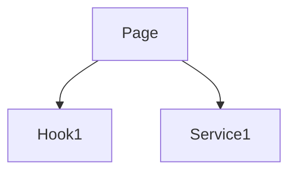

# 🗺️ CODE MAPPING - Mappatura Attiva Codice

> Mappa sistematicamente il codice basandoti **SOLO su dati reali**
> Output: `Production/Knowledge/[AREA]/Reports/[AREA]_COMPONENTI.md`

---

## 🔑 TRIGGER WORDS

`knowledge base` • `mappa/mappare/mappatura` • `scansiona/scansione` • `ricerca approfondita` • `inventario` • `documenta componenti` • `analizza area`

---

## ⚠️ REGOLA CRITICA

**LA MAPPATURA È UNA COSA SERIA**:
- ✅ SEMPRE leggere codice con **Read tool**
- ✅ SEMPRE validare esistenza con **Glob**
- ✅ SEMPRE basarsi su codice corrente reale
- ❌ MAI inventare componenti
- ❌ MAI assumere strutture senza verificare
- ❌ MAI copiare vecchia documentazione senza validare

---

## 📋 PROCESSO 7 STEP

### 1. IDENTIFICA AREA (2 min)
```bash
Area: "Autenticazione"
Path: src/features/auth/
Glob: src/features/auth/**/*.tsx
```

### 2. SCANSIONA FILE (5 min)
```bash
# USA GLOB per trovare file
Glob: src/features/[area]/**/*.tsx

# USA READ per LEGGERE OGNI file
Read: src/features/auth/LoginPage.tsx
Read: src/features/auth/RegisterPage.tsx
...

⚠️ CRITICAL: NON assumere - LEGGI tutto
```

### 3. ANALISI COMPONENTI (10 min)
Per ogni file letto, estrai:
- **Import**: Dipendenze (hooks, services, componenti)
- **Props/Types**: Interfacce e tipi
- **Complessità**:
  - Bassa: <100 LOC, no side effects
  - Media: 100-300 LOC, business logic moderata
  - Alta: >300 LOC, logica complessa
- **Responsabilità**: Cosa fa il componente

### 4. VERIFICA TEST (5 min)
```bash
# Cerca test esistenti
Glob: Production/Test/[Area]/**/*.spec.{js,ts}

# Per ogni componente:
- Ha test? ✅/❌
- Coverage stimato: X%
```

### 5. PRIORITIZZA P0-P3 (3 min)
- **P0**: Auth/Security, Payment, No test, Bug noti
- **P1**: User-facing principale, Alta complessità
- **P2**: Secondari, Utility, Test parziali
- **P3**: Display-only, Legacy, Coverage >80%

### 6. CREA REPORT (10 min)
```markdown
File: Production/Knowledge/[AREA]/Reports/[AREA]_COMPONENTI.md

# 🎯 [AREA] - Inventario Componenti

## 📊 Statistiche Rapide
- Componenti: X
- Hooks: Y
- Services: Z
- Gap Testing: N
- Priorità P0: M

## 📦 INVENTARIO

### ComponentName.tsx
- **Path**: `src/features/[area]/ComponentName.tsx`
- **Complessità**: Bassa/Media/Alta
- **LOC**: ~XXX
- **Props**: `{ prop1: type }`
- **Dipendenze**: useHook1, Service1
- **Responsabilità**: [1-2 righe]
- **Priorità**: P0/P1/P2/P3
- **Test**: ✅/⚠️/❌
- **Gap**: [cosa manca]

---

[Ripeti per ogni componente]

## 🎯 PRIORITÀ TESTING

### P0 - URGENTE (N componenti)
1. Component1 - [motivo]

### P1 - ALTA (N componenti)
1. Component2 - [motivo]

## 🔗 DIPENDENZE



## 🎯 RACCOMANDAZIONI
- [Quick wins]
- [Rischi identificati]
```

### 7. AGGIORNA TRACKING (5 min)
```bash
# Aggiorna stats globali
Edit: Production/Knowledge/STATISTICHE_GLOBALI.md

# Aggiorna changelog
Edit: Production/Knowledge/CHANGELOG_MAPPATURA.md

# Commit
git add Production/Knowledge/
git commit -m "docs: Mappatura [AREA] - N componenti, X gap

🗺️ Generated by CODE_MAPPING skill"
```

---

## ✅ CHECKLIST QUALITÀ

Prima di completare:

**Compliance**:
- [ ] TUTTI i file letti con Read tool
- [ ] ZERO assunzioni
- [ ] Props/types corrispondono al codice reale

**Documentazione**:
- [ ] Ogni componente documentato
- [ ] Complessità valutata
- [ ] Priorità P0-P3 assegnate
- [ ] Test gap identificati

**Output**:
- [ ] Report in Production/Knowledge/[AREA]/Reports/
- [ ] STATISTICHE_GLOBALI.md aggiornato
- [ ] CHANGELOG_MAPPATURA.md aggiornato
- [ ] Commit git con statistiche

---

## 📂 STRUTTURA OUTPUT

```
Production/Knowledge/
├── STATISTICHE_GLOBALI.md
├── CHANGELOG_MAPPATURA.md
├── [AREA]/
│   └── Reports/
│       └── [AREA]_COMPONENTI.md
└── TEMPLATES/
```

---

## 🎯 ESEMPIO RAPIDO

**Input**: "Mappa area Autenticazione"

**Output**:
```
✅ 6 componenti mappati
✅ 4 gap testing
✅ 2 componenti P0
✅ Report: Production/Knowledge/AUTENTICAZIONE/Reports/AUTENTICAZIONE_COMPONENTI.md
✅ Commit: docs: Mappatura Autenticazione - 6 componenti, 4 gap
```

---

## 🚫 ERRORI COMUNI

❌ Saltare file "semplici"
❌ Copiare descrizioni generiche
❌ Dimenticare dipendenze
❌ Ignorare test esistenti
❌ Dimenticare commit git

✅ Analizzare ogni file
✅ Identificare pattern
✅ Segnalare code smell
✅ Link test esistenti
✅ Aggiornare (non duplicare)

---

## 🔗 WORKFLOW INTEGRATO

```
CODE_MAPPING → TEST_ARCHITECT → TEST_GENERATOR
    ↓               ↓                ↓
 Inventario     Strategia         Test Code
```

---

**La mappatura serve per test e correzioni. Usa SOLO dati reali del codebase corrente.**
