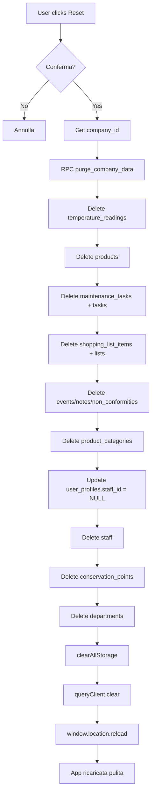

# 🔄 Reset App - Guida Completa

## 📋 Panoramica

Il sistema di reset dell'app è stato aggiornato per risolvere il problema del "ricaricamento fantasma" dei dati dopo il reset.

### Problema Precedente ❌

**Sintomo:** Dopo `resetApp()` i dati ricomparivano (es. 28 maintenance tasks, 7 conservation points).

**Causa:**
1. `resetApp()` puliva solo localStorage/sessionStorage
2. Il database Supabase **non veniva toccato**
3. Al ricarico, gli hook React Query ricaricavano i dati dal DB
4. La cache di React Query mostrava dati stale fino al refetch

### Soluzione Implementata ✅

**Reset completo in 3 fasi:**
1. ✅ **Purge Database** - Elimina tutti i dati Supabase per la company
2. ✅ **Purge Storage** - Pulisce localStorage + sessionStorage
3. ✅ **Purge Cache** - Svuota cache React Query + hard reload

---

## 🔧 Componenti della Soluzione

### 1. SQL Function: `purge_company_data()`

**Percorso:** `supabase/purge-company-data.sql`

**Funzionalità:**
- Elimina TUTTI i dati di una company in ordine FK-safe
- Rispetta le dipendenze di foreign key
- Restituisce statistiche dei record eliminati
- NON elimina `companies` né `user_profiles` (per permettere re-onboarding)

**Ordine di eliminazione (FK-safe):**

```sql
1. temperature_readings        -- FK: conservation_points
2. shopping_list_items         -- FK: shopping_lists
3. products                    -- FK: product_categories, departments, conservation_points
4. maintenance_tasks           -- FK: conservation_points, staff
5. tasks                       -- FK: departments, conservation_points, staff
6. events, notes, non_conformities
7. shopping_lists
8. product_categories
9. conservation_points
10. UPDATE user_profiles SET staff_id = NULL  -- Pulisce FK prima di eliminare staff
11. staff
12. departments
13. (opzionale) maintenance_tasks_backup
```

**Utilizzo:**

```sql
-- Esegui su Supabase SQL Editor
SELECT purge_company_data('c47b8b25-7257-4db3-a94c-d1693ff53cc5');

-- Output esempio:
{
  "temperature_readings": 15,
  "products": 6,
  "maintenance_tasks": 28,
  "tasks": 5,
  "conservation_points": 7,
  "departments": 4,
  "staff": 3,
  "product_categories": 4,
  "shopping_lists": 0,
  "shopping_list_items": 0,
  "user_profiles_updated": 1
}
```

### 2. Funzione Frontend: `resetApp()`

**Percorso:** `src/utils/onboardingHelpers.ts:653`

**Nuova implementazione:**

```typescript
export const resetApp = async (): Promise<void> => {
  // 1. Conferma utente con dialog dettagliato
  const confirmed = window.confirm('🚨 RESET COMPLETO APP + DATABASE...')

  // 2. Ottieni company_id da user_profiles
  const companyId = await getCompanyIdFromUserProfile()

  // 3. Purge database tramite RPC
  if (companyId) {
    await supabase.rpc('purge_company_data', { p_company_id: companyId })
  }

  // 4. Pulisce localStorage + sessionStorage
  clearAllStorage()

  // 5. Pulisce cache React Query
  window.queryClient.clear()

  // 6. Hard reload
  window.location.reload()
}
```

**Caratteristiche:**
- ✅ Funzione **async** per attendere il purge DB
- ✅ Gestione errori completa con try/catch
- ✅ Toast notifications per feedback utente
- ✅ Logging dettagliato in console

### 3. QueryClient Globale

**Percorso:** `src/main.tsx:49-55`

**Implementazione:**

```typescript
// Esponi queryClient globalmente
declare global {
  interface Window {
    queryClient: QueryClient
  }
}
window.queryClient = queryClient
```

**Perché necessario:**
- `resetApp()` viene chiamato da contesti senza accesso a React Context
- Serve per fare `.clear()` della cache senza dipendenze circolari

---

## 🚀 Come Usare il Reset

### Metodo 1: Dev Buttons (Consigliato per sviluppo)

1. Apri l'app in dev mode
2. Vai nella pagina Onboarding
3. Clicca il pulsante **"Reset Onboarding"** (rosso)
4. Conferma nel dialog
5. Attendi il completamento (circa 2-3 secondi)
6. L'app si ricaricherà automaticamente

### Metodo 2: Console Browser

```javascript
// Esegui nella console del browser
await window.resetApp()
```

### Metodo 3: SQL Diretto (Solo Database)

```sql
-- Esegui su Supabase SQL Editor
SELECT purge_company_data('c47b8b25-7257-4db3-a94c-d1693ff53cc5');

-- Poi nel browser:
localStorage.clear()
sessionStorage.clear()
window.queryClient.clear()
window.location.reload()
```

---

## ✅ Verifica Reset Completato

### 1. Verifica Database (Supabase SQL Editor)

```sql
-- Query di verifica - dovrebbe restituire 0 per tutte le tabelle
SELECT
  'temperature_readings' as table_name,
  COUNT(*) as count
FROM temperature_readings
WHERE company_id = 'c47b8b25-7257-4db3-a94c-d1693ff53cc5'

UNION ALL SELECT 'products', COUNT(*)
FROM products WHERE company_id = 'c47b8b25-7257-4db3-a94c-d1693ff53cc5'

UNION ALL SELECT 'maintenance_tasks', COUNT(*)
FROM maintenance_tasks WHERE company_id = 'c47b8b25-7257-4db3-a94c-d1693ff53cc5'

UNION ALL SELECT 'conservation_points', COUNT(*)
FROM conservation_points WHERE company_id = 'c47b8b25-7257-4db3-a94c-d1693ff53cc5'

UNION ALL SELECT 'departments', COUNT(*)
FROM departments WHERE company_id = 'c47b8b25-7257-4db3-a94c-d1693ff53cc5'

UNION ALL SELECT 'staff', COUNT(*)
FROM staff WHERE company_id = 'c47b8b25-7257-4db3-a94c-d1693ff53cc5';

-- Risultato atteso: count = 0 per tutte le righe
```

### 2. Verifica Storage (Browser Console)

```javascript
// Tutte dovrebbero restituire null o essere vuote
localStorage.getItem('onboarding-data')
localStorage.getItem('onboarding-completed')
sessionStorage.length

// QueryClient cache dovrebbe essere vuota
window.queryClient.getQueryCache().getAll().length  // = 0
```

### 3. Verifica UI

- ✅ Onboarding wizard si apre automaticamente
- ✅ Nessun dato pre-compilato nei form
- ✅ Tab principali (Conservazione, Attività, etc.) sono vuote
- ✅ Nessun errore in console

---

## 🔍 Troubleshooting

### Errore: "purge_company_data does not exist"

**Causa:** La SQL function non è stata creata su Supabase.

**Soluzione:**
1. Apri Supabase Dashboard → SQL Editor
2. Copia/incolla il contenuto di `supabase/purge-company-data.sql`
3. Esegui lo script
4. Riprova il reset

### Errore: "window.queryClient is undefined"

**Causa:** Il QueryClient non è stato esposto globalmente.

**Soluzione:**
1. Verifica che `src/main.tsx` contenga:
   ```typescript
   window.queryClient = queryClient
   ```
2. Ricarica la pagina
3. Riprova

### I dati ricompaiono ancora

**Possibili cause:**

1. **Cache Service Worker:** Disabilita service worker in dev tools
2. **Cache Browser:** Fai hard reload (Ctrl+Shift+R)
3. **Multiple Tabs:** Chiudi tutte le tab dell'app
4. **Purge DB fallito:** Controlla console per errori RPC

**Debug step-by-step:**

```javascript
// 1. Verifica company_id
const clerkUserId = localStorage.getItem('clerk-user-id')
console.log('Clerk User ID:', clerkUserId)

// 2. Ottieni company_id
const { data } = await supabase
  .from('user_profiles')
  .select('company_id')
  .eq('clerk_user_id', clerkUserId)
  .single()
console.log('Company ID:', data?.company_id)

// 3. Verifica contatori DB
const { data: tasks } = await supabase
  .from('maintenance_tasks')
  .select('id')
  .eq('company_id', data?.company_id)
console.log('Maintenance Tasks:', tasks?.length)

// 4. Manualmente purge
const { data: stats, error } = await supabase.rpc('purge_company_data', {
  p_company_id: data?.company_id
})
console.log('Purge Stats:', stats)
console.log('Purge Error:', error)
```

---

## ⚠️ Avvertenze

### Sicurezza

- ✅ **RLS è disabilitato** - la sicurezza è a livello applicazione
- ✅ La function è `SECURITY DEFINER` - eseguita con privilegi owner
- ⚠️ **NON esporre questa funzione in produzione** senza autenticazione aggiuntiva

### Performance

- ⏱️ Il purge può richiedere 1-3 secondi per company con molti dati
- 🔄 La page reload avviene dopo il purge (no flash di dati vecchi)
- 💾 Cache QueryClient viene svuotata prima del reload

### Data Loss

- 🚨 **IRREVERSIBILE** - nessun modo di recuperare i dati
- ✅ User profiles e companies **NON vengono eliminati**
- ✅ Permette re-onboarding immediato dopo reset

---

## 📊 Schema FK Dependencies

Visualizzazione gerarchica delle dipendenze:

```
companies (NON eliminato)
├── departments
│   ├── staff
│   ├── conservation_points
│   │   ├── temperature_readings
│   │   ├── maintenance_tasks
│   │   └── tasks
│   ├── products
│   └── tasks
├── product_categories
│   └── products
├── shopping_lists
│   └── shopping_list_items
├── staff
│   ├── maintenance_tasks (assigned_to_staff_id)
│   ├── tasks (assigned_to_staff_id)
│   └── user_profiles (staff_id FK)
├── events
├── notes
└── non_conformities
```

---

## 🔄 Flusso Completo Reset



---

## 📝 Changelog

### Versione 2.0 (2025-10-06)

**Modifiche:**
- ✅ Creata SQL function `purge_company_data()`
- ✅ Aggiornata `resetApp()` per chiamare RPC
- ✅ Esposto `queryClient` globalmente
- ✅ Aggiunto hard reset cache
- ✅ Gestione errori migliorata
- ✅ Documentazione completa

**Risolto:**
- ✅ Dati che ricomparivano dopo reset
- ✅ Cache React Query stale
- ✅ Foreign key violations durante purge

### Versione 1.0 (Precedente)

**Limitazioni:**
- ❌ Solo localStorage/sessionStorage reset
- ❌ Database non toccato
- ❌ Cache non gestita

---

**Autore:** Claude Code
**Data:** 2025-10-06
**Status:** ✅ Pronto per uso in sviluppo
**Warning:** ⚠️ NON usare in produzione senza autenticazione aggiuntiva
