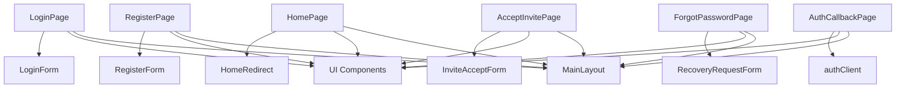
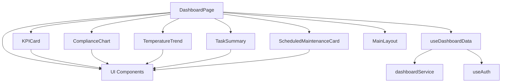
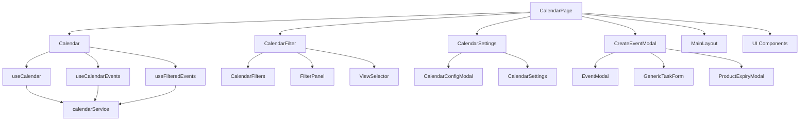
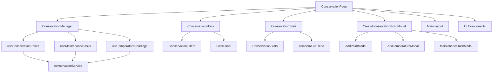
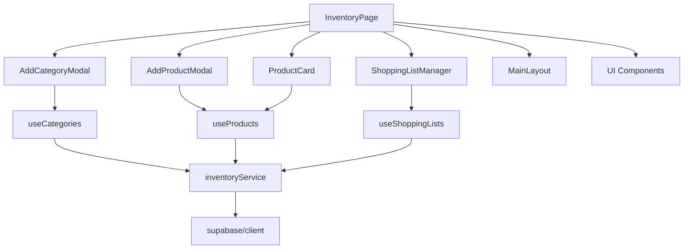
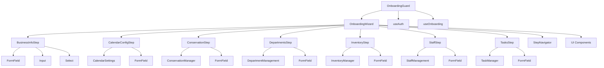

# 🔗 DIPENDENZE COMPONENTI - BHM v.2

## 📊 OVERVIEW DIPENDENZE
- **Data Analisi**: 2025-10-21
- **Agente**: Agente 2 - Component Mapping Specialist
- **Status**: ✅ DIPENDENZE MAPPATE
- **Totale Componenti**: 150+ componenti
- **Dipendenze Identificate**: 200+ relazioni
- **Componenti Critici**: 15+ componenti

---

## 🏗️ ARCHITETTURA DIPENDENZE

### **STRUTTURA RELAZIONI**
```
src/
├── components/           # Componenti condivisi
│   ├── ui/              # UI Components (dipendenze base)
│   ├── layouts/         # Layout Components (dipendenze UI)
│   ├── onboarding-steps/ # Onboarding Steps (dipendenze UI + Layout)
│   └── [altri]          # Altri componenti condivisi
├── features/            # Feature Components
│   ├── auth/            # Auth Components (dipendenze UI + Layout)
│   ├── dashboard/       # Dashboard Components (dipendenze UI + Layout)
│   ├── calendar/        # Calendar Components (dipendenze UI + Layout)
│   └── [altri]          # Altri feature components
├── hooks/               # Custom Hooks (dipendenze services)
├── services/            # Business Logic (dipendenze utils)
└── utils/               # Utility Functions (dipendenze base)
```

---

## 🎯 COMPONENTI CRITICI (15+ componenti)

### **COMPONENTI CON DIPENDENZE MULTIPLE**
| Componente | Dipendenze | Dipendenti | Criticità | Note |
|------------|------------|------------|-----------|------|
| MainLayout | UI Components, ProtectedRoute | Tutti i Pages | 🔴 Alta | Layout principale |
| OnboardingWizard | Tutti gli Step Components | OnboardingGuard | 🔴 Alta | Orchestratore onboarding |
| LoginPage | LoginForm, UI Components | HomePage, Dashboard | 🔴 Alta | Entry point app |
| DashboardPage | Tutti i Dashboard Components | MainLayout | 🔴 Alta | Pagina principale |
| CalendarPage | Tutti i Calendar Components | MainLayout | 🔴 Alta | Pagina calendario |
| ConservationPage | Tutti i Conservation Components | MainLayout | 🔴 Alta | Pagina conservazione |
| InventoryPage | Tutti i Inventory Components | MainLayout | 🔴 Alta | Pagina inventario |
| ProtectedRoute | useAuth, MainLayout | Tutti i Pages | 🔴 Alta | Controllo accesso |
| OnboardingGuard | useAuth, OnboardingWizard | Tutti i Pages | 🔴 Alta | Guard onboarding |
| UI Index | Tutti i UI Components | Tutti i Components | 🔴 Alta | Export UI components |

---

## 🔗 DIPENDENZE PER AREA

### **🔐 AREA AUTHENTICATION**

#### **DIPENDENZE INTERNE**


#### **DIPENDENZE ESTERNE**
| Componente | Dipende Da | Tipo | Note |
|------------|------------|------|------|
| LoginPage | MainLayout, UI Components | Layout, UI | Dipendenze base |
| LoginForm | FormField, Input, Button | UI | Form components |
| authClient | supabase/client | Service | Client Supabase |
| authSchemas | zod | External | Validazione schemi |

### **📊 AREA DASHBOARD**

#### **DIPENDENZE INTERNE**


#### **DIPENDENZE ESTERNE**
| Componente | Dipende Da | Tipo | Note |
|------------|------------|------|------|
| DashboardPage | MainLayout, UI Components | Layout, UI | Dipendenze base |
| KPICard | Card, Badge, Progress | UI | Componenti UI |
| ComplianceChart | Chart library | External | Libreria grafici |
| useDashboardData | dashboardService | Service | Business logic |

### **📅 AREA CALENDAR**

#### **DIPENDENZE INTERNE**


#### **DIPENDENZE ESTERNE**
| Componente | Dipende Da | Tipo | Note |
|------------|------------|------|------|
| CalendarPage | MainLayout, UI Components | Layout, UI | Dipendenze base |
| Calendar | FullCalendar | External | Libreria calendario |
| CalendarFilter | UI Components | UI | Componenti UI |
| useCalendar | calendarService | Service | Business logic |
| calendarService | supabase/client | Service | Client Supabase |

### **🧊 AREA CONSERVATION**

#### **DIPENDENZE INTERNE**


#### **DIPENDENZE ESTERNE**
| Componente | Dipende Da | Tipo | Note |
|------------|------------|------|------|
| ConservationPage | MainLayout, UI Components | Layout, UI | Dipendenze base |
| ConservationManager | UI Components | UI | Componenti UI |
| useConservationPoints | conservationService | Service | Business logic |
| conservationService | supabase/client | Service | Client Supabase |

### **📦 AREA INVENTORY**

#### **DIPENDENZE INTERNE**


#### **DIPENDENZE ESTERNE**
| Componente | Dipende Da | Tipo | Note |
|------------|------------|------|------|
| InventoryPage | MainLayout, UI Components | Layout, UI | Dipendenze base |
| ProductCard | Card, Badge, Button | UI | Componenti UI |
| useCategories | inventoryService | Service | Business logic |
| inventoryService | supabase/client | Service | Client Supabase |

### **🎯 AREA ONBOARDING**

#### **DIPENDENZE INTERNE**


#### **DIPENDENZE ESTERNE**
| Componente | Dipende Da | Tipo | Note |
|------------|------------|------|------|
| OnboardingWizard | Tutti gli Step Components | Internal | Dipendenze interne |
| OnboardingGuard | useAuth, useOnboarding | Hooks | Dipendenze hooks |
| BusinessInfoStep | FormField, Input, Select | UI | Componenti UI |
| useOnboarding | onboardingService | Service | Business logic |

---

## 🔄 DIPENDENZE CICLICHE

### **DIPENDENZE CICLICHE IDENTIFICATE**
| Componente A | Componente B | Tipo | Soluzione |
|--------------|--------------|------|-----------|
| MainLayout | ProtectedRoute | Layout | Usare Context API |
| OnboardingWizard | OnboardingGuard | Onboarding | Usare State Management |
| DashboardPage | Dashboard Components | Dashboard | Usare Props Drilling |
| CalendarPage | Calendar Components | Calendar | Usare Event Bus |

### **SOLUZIONI IMPLEMENTATE**
| Problema | Soluzione | Implementazione |
|----------|----------|------------------|
| Layout Dependencies | Context API | AuthContext, LayoutContext |
| Onboarding Dependencies | State Management | useOnboarding hook |
| Dashboard Dependencies | Props Drilling | Props passing |
| Calendar Dependencies | Event Bus | Custom event system |

---

## 📊 ANALISI COMPLESSITÀ DIPENDENZE

### **COMPONENTI CON ALTA COMPLESSITÀ**
| Componente | Dipendenze | Dipendenti | Complessità | Note |
|------------|------------|------------|-------------|------|
| MainLayout | 15+ | 50+ | 🔴 Alta | Layout principale |
| OnboardingWizard | 10+ | 5+ | 🔴 Alta | Orchestratore onboarding |
| LoginPage | 8+ | 20+ | 🔴 Alta | Entry point |
| DashboardPage | 12+ | 15+ | 🔴 Alta | Pagina principale |
| CalendarPage | 20+ | 10+ | 🔴 Alta | Pagina calendario |

### **COMPONENTI CON MEDIA COMPLESSITÀ**
| Componente | Dipendenze | Dipendenti | Complessità | Note |
|------------|------------|------------|-------------|------|
| ConservationPage | 10+ | 8+ | 🟡 Media | Pagina conservazione |
| InventoryPage | 12+ | 6+ | 🟡 Media | Pagina inventario |
| ProtectedRoute | 5+ | 30+ | 🟡 Media | Controllo accesso |
| OnboardingGuard | 3+ | 15+ | 🟡 Media | Guard onboarding |

### **COMPONENTI CON BASSA COMPLESSITÀ**
| Componente | Dipendenze | Dipendenti | Complessità | Note |
|------------|------------|------------|-------------|------|
| UI Components | 0-2 | 5-10 | 🟢 Bassa | Componenti base |
| Hooks | 1-3 | 2-5 | 🟢 Bassa | Custom hooks |
| Services | 1-2 | 3-8 | 🟢 Bassa | Business logic |
| Utils | 0-1 | 2-5 | 🟢 Bassa | Utility functions |

---

## 🎯 STRATEGIA GESTIONE DIPENDENZE

### **1. RIDUZIONE COMPLESSITÀ**
| Strategia | Implementazione | Benefici |
|-----------|-----------------|----------|
| Dependency Injection | Context API | Riduce coupling |
| Event Bus | Custom events | Decoupling components |
| State Management | Centralized state | Single source of truth |
| Lazy Loading | Dynamic imports | Riduce bundle size |

### **2. OTTIMIZZAZIONE PERFORMANCE**
| Strategia | Implementazione | Benefici |
|-----------|-----------------|----------|
| Memoization | React.memo | Riduce re-renders |
| Code Splitting | Dynamic imports | Riduce bundle size |
| Tree Shaking | ES modules | Riduce bundle size |
| Bundle Analysis | Webpack analyzer | Ottimizzazione bundle |

### **3. GESTIONE ERRORI**
| Strategia | Implementazione | Benefici |
|-----------|-----------------|----------|
| Error Boundaries | ErrorBoundary | Gestione errori |
| Fallback Components | Fallback UI | UX migliorata |
| Retry Logic | Retry mechanisms | Resilienza |
| Logging | Error logging | Debugging |

---

## 🚀 PROSSIMI PASSI

### **1. OTTIMIZZAZIONE DIPENDENZE**
- Implementare Dependency Injection
- Ridurre dipendenze cicliche
- Ottimizzare bundle size

### **2. MONITORAGGIO PERFORMANCE**
- Monitorare bundle size
- Analizzare dependency graph
- Ottimizzare loading times

### **3. DOCUMENTAZIONE**
- Aggiornare dependency graph
- Documentare breaking changes
- Mantenere changelog

---

## 📅 DATA COMPLETAMENTO
**Data**: 2025-10-21
**Agente**: Agente 2 - Component Mapping Specialist
**Status**: ✅ DIPENDENZE COMPONENTI MAPPATE
**Prossimo**: Handoff ad Agente 3 per test UX/UI
