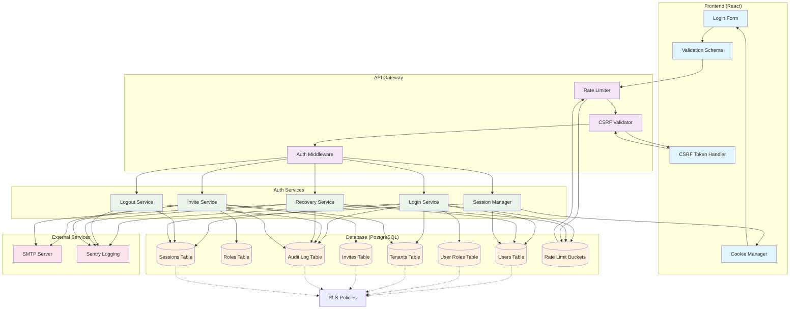

# System Diagram - Login Hardening Subsystem

**Data**: 2025-10-20  
**Autore**: Agente 2 (Systems/API/DB)  
**Versione**: 1.0

## Overview

Diagramma del sottosistema di autenticazione hardening con tutti i componenti, flussi e interazioni.

## System Architecture Diagram

## Component Details

### Frontend Layer
- **Login Form**: UI component con validazione schema-based
- **Validation Schema**: Zod/Yup per validazione client-side
- **CSRF Token Handler**: Gestione token per protezione CSRF
- **Cookie Manager**: Gestione cookie di sessione sicuri

### API Gateway Layer
- **Rate Limiter**: Multi-bucket (IP/Account/UA) con backoff
- **CSRF Validator**: Validazione token per azioni mutanti
- **Auth Middleware**: Middleware di autenticazione e autorizzazione

### Core Auth Services
- **Login Service**: Gestione login con validazione credenziali
- **Logout Service**: Gestione logout e invalidazione sessione
- **Recovery Service**: Gestione password recovery con token
- **Invite Service**: Gestione inviti utente e bootstrap admin
- **Session Manager**: Gestione sessioni sicure con rotazione

### Database Layer
- **Users Table**: Profili utente con password hash
- **Roles Table**: Ruoli sistema (owner, admin, manager, operator)
- **User Roles Table**: Associazione utenti-ruoli-tenant
- **Tenants Table**: Organizzazioni multi-tenant
- **Invites Table**: Inviti utente con token
- **Audit Log Table**: Log sicurezza e telemetria
- **Sessions Table**: Sessioni attive con CSRF token
- **Rate Limit Buckets**: Bucket per rate limiting

### External Services
- **SMTP Server**: Invio email per recovery e inviti
- **Sentry Logging**: Telemetria errori e performance

## Security Flows

### Login Flow
1. User → Login Form → Validation Schema
2. Rate Limiter → CSRF Check → Auth Middleware
3. Login Service → Database (Users, Sessions, Audit)
4. Session Manager → Cookie (httpOnly/secure/sameSite=strict)

### Logout Flow
1. User → Logout Request → CSRF Check
2. Logout Service → Invalidate Session → Clear Cookie
3. Audit Log → Sentry

### Recovery Flow
1. User → Recovery Request → Rate Limiter
2. Recovery Service → Generate Token → SMTP
3. User → Recovery Confirm → Validate Token → Update Password
4. Session Rotation → New Cookie

### Invite Flow
1. Admin → Create Invite → CSRF Check
2. Invite Service → Generate Token → SMTP
3. User → Accept Invite → Validate Token → Create User
4. Assign Role → Session Creation

## RLS (Row Level Security)

Tutte le tabelle hanno RLS abilitato con default deny:
- **Users**: Self-read, admin write
- **User Roles**: Tenant-scoped read/write
- **Tenants**: Admin-only write
- **Invites**: Creator/admin read, anon accept
- **Audit Log**: Security/admin read only
- **Sessions**: User-scoped access

## Performance Considerations

- **Rate Limiting**: Sliding window con cleanup automatico
- **Session Management**: Rolling session con idle timeout
- **Database**: Indici ottimizzati per query frequenti
- **Caching**: Session cache per performance
- **Monitoring**: Metriche real-time per performance

## Security Features

- **CSRF Protection**: Double-submit token pattern
- **Session Security**: HttpOnly, secure, sameSite=strict
- **Rate Limiting**: Multi-bucket con backoff progressivo
- **Password Policy**: Solo lettere, min 12 char, denylist
- **Audit Logging**: Tracciamento completo eventi sicurezza
- **Error Handling**: Messaggi generici, no information leakage
