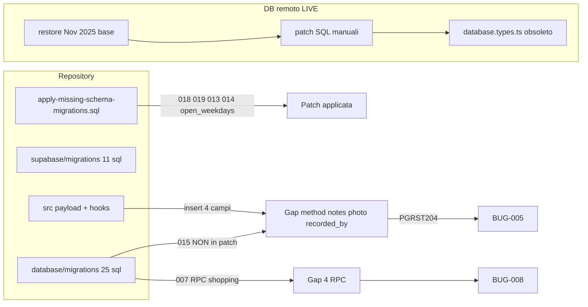

# FASE 3 — Inventario migration gaps (DB live vs repo)

> **Fonte**: [`FASE3_REPORT_A0_DB_SCHEMA.md`](./FASE3_REPORT_A0_DB_SCHEMA.md) §Inventario + Supplemento DB live (MCP `supabase-bhm`, 2026-07-05)  
> **Progetto**: `hjteuounjwkadmsbsmdm.supabase.co`  
> **Consolidato**: Agente A8 · read-only — nessuna migration applicata in Fase 3

---

## Legenda stato LIVE

| Simbolo | Significato |
|---------|-------------|
| ✅ | Presente su DB remoto (verificato MCP `execute_sql` / `list_tables`) |
| ❌ | Assente su DB remoto |
| ⚠️ | Parziale o non tracciato in Supabase CLI history |
| 🔧 | Coperto da `BackupDB/apply-missing-schema-migrations.sql` |
| 📦 | Solo in `supabase/migrations/` |
| 📁 | Solo in `database/migrations/` |

**Nota critica**: `list_migrations` → `[]` (zero righe). Lo schema live deriva da **restore Nov 2025 + SQL manuali**, non da `supabase db push`.

---

## Executive summary gap

| Priorità | Gap | Impatto utente | Fix nel repo |
|----------|-----|----------------|--------------|
| **P0** | Migration **015** non applicata | Salvataggio temperatura bloccato (BUG-005) | `database/migrations/015_add_temperature_reading_fields.sql` |
| **P0** | **4 RPC shopping** assenti | Liste spesa non funzionano (BUG-008) | `database/migrations/007_shopping_lists_verification.sql`, `database/rls/shopping_lists_policies.sql` |
| **P1** | `database.types.ts` non rigenerato | Type-safety falsa; analisi future errate (BUG-DB-002) | `npm run` generate types post-migration |
| **P2** | Migration 016 `next_due` alias | Basso — insert auto-complete usa `next_due_date` | `database/migrations/016_*` |
| **P2** | Migration 010 categorie estese | `AddCategoryModal` campi HACCP assenti su live | `database/migrations/010_*` |
| **P2** | Colonne prodotti scadenze | `expired_at`, reinsert/archived (BUG-010/022) | Verificare migration in `database/migrations/` |
| **P3** | Migration 017 seed categorie | Dati seed temperature | `database/migrations/017_*` |
| **P3** | Migration 020–021 categorie | Sostituzione categorie prodotti | `database/migrations/020_*`, `021_*` |

---

## Matrice migration numerate (`database/migrations/`)

| ID / file | Contenuto sintetico | supabase/ | apply-missing | LIVE MCP | Priorità |
|-----------|---------------------|-----------|---------------|----------|----------|
| **015** `add_temperature_reading_fields` | `method`, `notes`, `photo_evidence`, `recorded_by` | ❌ | ❌ | ❌ | **P0** |
| 013 `time_management` (tasks) | JSONB orari | ❌ | 🔧 | ✅ | — |
| 014 `recurrence_config` (tasks) | JSONB ricorrenza | ❌ | 🔧 | ✅ | — |
| 018 `conservation_profile_fields` | profili punto | 📦 `20260705150000` | 🔧 | ✅ | — |
| 019 `recurrence_config` (maintenance) | JSONB ricorrenza | ❌ | 🔧 | ✅ | — |
| 019 `create_custom_profiles_table` | `cons_point_custom_profile` | 📦 (in 20260705150000) | 🔧 | ✅ | — |
| 009 design calendario | `open_weekdays` vs `working_days` | ❌ | 🔧 | ✅ | — |
| 016 `maintenance_completions` | alias `next_due` | ❌ | ❌ | ⚠️ solo `next_due_date` | P3 |
| 010 `extend_product_categories` | allergeni, expiry default | ❌ | ❌ | ❌ colonne estese | P2 |
| 017 seed category temperature | dati seed | ❌ | ❌ | — | P3 |
| 020–021 product categories | sostituzione categorie | ❌ | ❌ | — | P3 |
| 007 shopping lists verification | **4 RPC** liste spesa | ❌ | ❌ | ❌ RPC assenti | **P0** |

---

## Matrice migration Supabase CLI (`supabase/migrations/`)

| File | Contenuto | LIVE MCP | Note |
|------|-----------|----------|------|
| `20260124120000_add_expiry_check_*` | CHECK `expiry_check` | ✅ | BUG-DB-001 **revocato** |
| `20260201120000_trigger_maintenance_task_recurrence.sql` | Trigger post-completamento | ✅ su `maintenance_completions` | Correzione A2 vs A0 |
| `20260705140000_fix_companies_onboarding_rls.sql` | RLS companies onboarding | ✅ | Verificato A1 |
| `20250127000001_csrf_tokens.sql` | Tabella CSRF | ✅ (0 righe) | Schema ok |
| `20260705150000_*` | Profili conservation | ✅ | In apply-missing |
| Altri 11 file totali | Subset schema | ⚠️ non in history CLI | Parzialmente riflessi |

---

## Patch post-restore (`BackupDB/`)

| Patch | Cosa copre | Cosa **non** copre | LIVE |
|-------|------------|-------------------|------|
| `apply-missing-schema-migrations.sql` | 018 profili, 019 recurrence, 013–014 tasks, `cons_point_custom_profile`, `open_weekdays` | **015**, 016, 017, 020–021, RPC shopping | ✅ parziale |
| `fix-calendar-open-weekdays.sql` | Solo `open_weekdays` | Duplicato parziale apply-missing §5 | ✅ |
| `fix-companies-insert-onboarding.sql` | RLS INSERT/SELECT companies | — | ✅ (A1) |
| `fix-signup-policies-minimal.sql` | RLS signup/inviti | — | ✅ (A1) |
| `restore-bhm-public.sql` | Baseline Nov 2025 | Schema evoluto Gen–Feb 2026 | Solo confronto |

**Azione raccomandata**: estendere `apply-missing-schema-migrations.sql` con §015 e RPC shopping prima di nuovi restore.

---

## Tabelle critiche — colonne LIVE vs codice

### `temperature_readings` — ❌ BUG-005

| Colonna | LIVE | Migration 015 | Payload app |
|---------|------|---------------|-------------|
| `id`, `company_id`, `conservation_point_id`, `temperature`, `recorded_at`, `created_at` | ✅ | base | ✅ |
| `method`, `notes`, `photo_evidence`, `recorded_by` | ❌ | ✅ | ✅ |

### `conservation_points` — ✅ (post patch)

| Colonna | LIVE | `database.types.ts` |
|---------|------|---------------------|
| `appliance_category`, `profile_id`, `profile_config`, `is_custom_profile` | ✅ | ❌ assenti |

### `maintenance_tasks` — ✅

| Elemento | LIVE |
|----------|------|
| `recurrence_config` | ✅ |
| CHECK include `expiry_check` | ✅ |
| Trigger ricorrenza su `maintenance_completions` | ✅ |

### `company_calendar_settings` — ✅

| Colonna | LIVE | `database.types.ts` |
|---------|------|---------------------|
| `working_days` | ✅ | ✅ |
| `open_weekdays` | ✅ | ❌ assente |

### `products` — ⚠️ parziale

| Colonna | LIVE | Usata da codice |
|---------|------|-----------------|
| 20 colonne base CRUD | ✅ | `AddProductModal` |
| `expired_at` | ❌ | `useExpiryTracking` |
| `previous_product_id`, `reinsertion_count`, `archived_at` | ❌ | `useExpiredProducts` |
| status `archived` in CHECK | ❌ | reinsert flow |

### RPC `public` — shopping

| RPC | LIVE |
|-----|------|
| `create_shopping_list_with_items` | ❌ |
| `get_shopping_lists_with_stats` | ❌ |
| `toggle_shopping_list_item` | ❌ |
| `complete_shopping_list` | ❌ |

### Tabelle assenti vs codice Settings

| Tabella / colonna | LIVE | Componente |
|-------------------|------|------------|
| `notification_preferences` | ❌ | `NotificationPreferences.tsx` |
| `companies.phone`, `vat_number`, `license_number`, … | ❌ | `CompanyConfiguration.tsx` |

---

## `database/migrations/` non mappati in `supabase/migrations/` (audit pendente)

Campione da audit separato vs `20251025121942_create_complete_schema.sql`:

- `005_user_activity_logs`
- `006_update_user_sessions`
- `007_shopping_lists_verification` ← **P0 gap live**
- `008_*`
- `009_add_department_filters*`
- `010_extend_product_categories`
- `011-012` department tasks
- `fix_rls_signup_policies.sql`

Possibile sovrapposizione parziale con schema iniziale Supabase CLI — richiede diff mirato prima di deploy.

---

## Diagramma drift (sintesi)

---

## Checklist Owner (pre-implementazione)

- [ ] Applicare Migration **015** su remoto (o includere in apply-missing)
- [ ] Deploy **4 RPC** shopping + verificare RLS policies
- [ ] Rigenerare `src/types/database.types.ts` da schema post-fix
- [ ] Valutare migration colonne `products` scadenze + `companies` estesi + tabella `notification_preferences`
- [ ] Allineare canale ufficiale: `supabase/migrations/` vs `database/migrations/` (BUG-DB-003)
- [ ] Dopo fix BUG-005: rivalutare BUG-006 (modal chiusura)

---

## Riferimenti

| Path | Ruolo |
|------|-------|
| [`FASE3_REPORT_A0_DB_SCHEMA.md`](./FASE3_REPORT_A0_DB_SCHEMA.md) | Report completo A0 + supplemento MCP |
| [`FASE3_REPORT_A2_CONSERVATION.md`](./FASE3_REPORT_A2_CONSERVATION.md) | Conferma BUG-005 + correzione trigger |
| [`FASE3_REPORT_A5_INVENTORY.md`](./FASE3_REPORT_A5_INVENTORY.md) | Conferma RPC shopping assenti |
| [`BUG_TRACKER.md`](../../../BUG_TRACKER.md) | Bug consolidati A8 |
| `database/migrations/015_add_temperature_reading_fields.sql` | Definizione colonne mancanti |
| `BackupDB/apply-missing-schema-migrations.sql` | Patch post-restore (senza 015) |

---

*Generato da Agente A8 — Fase 3 consolidamento · 2026-07-05*
