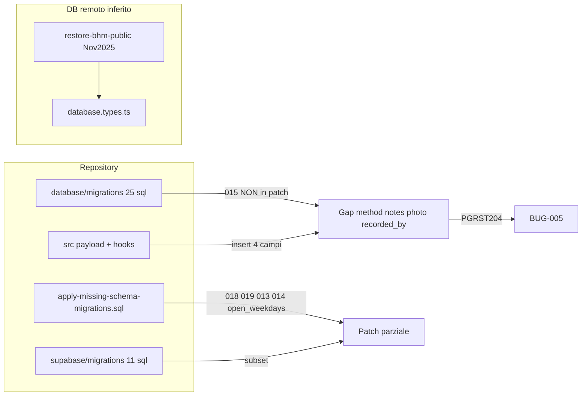

# Report FASE 3 — Area A0 DB / Schema drift

**Data**: 2026-07-05  
**Agente**: A0  
**Modalità**: read-only  
**Priorità**: P0 — blocca Conservation (BUG-005)

---

## 5.1 Executive summary

| Metrica | Valore |
|---------|--------|
| Elementi verificati | 24 |
| Allineati repo↔tipi↔restore baseline | 6 |
| Gap critici (bloccano runtime) | 3 |
| Gap medi (feature parziali / rischio insert) | 5 |
| Gap bassi / debito organizzativo | 4 |
| Verifica live DB remoto | ✅ **completata** 2026-07-05 via MCP `supabase-bhm` (vedi Supplemento DB live) |

**Esito area**: 🔴 **verificato-rotto** — drift strutturale tra codice app, cartelle migration e schema documentato come deployato (backup Nov 2025 + patch parziali).

**Messaggio per A2 (Conservation)**: su `temperature_readings` le colonne `method`, `notes`, `photo_evidence`, `recorded_by` **assenti sul remoto live** (MCP `execute_sql` 2026-07-05 — solo 6 colonne base). Coerente con `database.types.ts` e BUG-005 runtime. **Patch apply-missing è stata applicata** per profili conservazione, `recurrence_config`, `open_weekdays` — ma **non** Migration 015. `database.types.ts` è **obsoleto** rispetto allo schema live (mancano colonne già presenti su DB).

---

## 5.2 Matrice verifica

### A — Due cartelle migration (drift organizzativo)

| Feature / Artefatto | Doc / convenzione | Repo reale | DB (restore + tipi) | Esito |
|---------------------|-------------------|------------|---------------------|-------|
| Cartella canonica Supabase CLI | `supabase/migrations/` | 11 file SQL | — | ⚠️ Solo subset dello schema evoluto |
| Cartella legacy/manuale | `database/migrations/` | 27 file (25 `.sql` + 2 utility) | — | ⚠️ Molte migration **non replicate** in `supabase/migrations/` |
| Migration 015 (`temperature_reading_fields`) | HANDOFF, BUG-005 | `database/migrations/015_add_temperature_reading_fields.sql` | **Assente** in `supabase/migrations/` | ❌ |
| Migration 018 profili conservazione | Report Gen 2026 | Duplicata: `database/migrations/018_*` + `supabase/migrations/20260705150000_*` | Tipi: colonne profilo **assenti** in `database.types.ts` | ⚠️ In repo sì, su remoto **non verificato live** |
| Auth hardening + CSRF | Report 07-02 | Solo in `supabase/migrations/20250120*` + `20250127000001` | Tipi: tabelle `csrf_tokens` presenti in restore | ⚠️ |
| `expiry_check` su `maintenance_tasks.type` | Codice conservazione | `supabase/migrations/20260124120000_*` | Restore CHECK: solo `temperature`, `sanitization`, `defrosting` (`restore-bhm-public.sql:352`) | ⚠️ Rischio insert onboarding se migration non applicata |

### B — Patch post-restore (`BackupDB/`)

| Patch | Cosa copre | Cosa **non** copre | Esito |
|-------|------------|-------------------|-------|
| `apply-missing-schema-migrations.sql` | `conservation_points` profili (018), `maintenance_tasks.recurrence_config` (019), `tasks.time_management` + `recurrence_config` (013–014), tabella `cons_point_custom_profile`, `company_calendar_settings.open_weekdays` | **Migration 015** (`method`, `notes`, `photo_evidence`, `recorded_by`), Migration 016 (`maintenance_completions.next_due`), 017 seed, 020–021 categorie | ❌ Lacuna confermata su 015 |
| `fix-calendar-open-weekdays.sql` | Solo `open_weekdays` | Duplicato parziale di apply-missing §5 | ⚠️ Script frammentato |
| `restore-bhm-public.sql` | Baseline Nov 2025 progetto `hjteuounjwkadmsbsmdm` | Schema evoluto Gen–Feb 2026 | Baseline per confronto |

### C — Tabelle critiche (schema vs codice vs tipi)

| Tabella | Colonne attese dal codice | In `restore-bhm-public.sql` | In `database.types.ts` | Esito |
|---------|---------------------------|------------------------------|------------------------|-------|
| `temperature_readings` | 6 base + `method`, `notes`, `photo_evidence`, `recorded_by` (`useTemperatureReadings.ts:147-156`) | Solo 6 colonne base (`restore-bhm-public.sql:576-583`) | Solo 6 colonne (`database.types.ts:1647-1671`) | ❌ **BUG-005** |
| `conservation_points` | `appliance_category`, `profile_id`, `profile_config`, `is_custom_profile` (`AddPointModal.tsx:1021+`) | Assenti (`restore-bhm-public.sql:146-161`) | Assenti (`database.types.ts:306-320`) | ⚠️ Patch in apply-missing; tipi non rigenerati / remoto incerto |
| `cons_point_custom_profile` | Usata da conservazione custom profiles | **Tabella assente** in restore | **Tabella assente** in tipi | ⚠️ Creata in apply-missing + supabase `20260705150000` |
| `maintenance_tasks` | `recurrence_config` (`AddPointModal.tsx:958-983`) | Assente in restore | Assente in tipi (`database.types.ts:847-875`) | ⚠️ |
| `maintenance_tasks.type` | Include `expiry_check` (`onboardingHelpers.ts:1416`, `conservation.ts:168`) | CHECK senza `expiry_check` | `type: string` (no enum in tipi) | ⚠️ |
| `tasks` | `time_management`, `recurrence_config` (migration 013–014) | Assenti in restore | Assenti in tipi (`database.types.ts:1540-1565`) | ⚠️ |
| `company_calendar_settings` | `open_weekdays` (`useCalendarSettings.ts:52,75,101`) | Solo `working_days` (`restore-bhm-public.sql:112-127`) | Solo `working_days` (`database.types.ts:196-212`) | ⚠️ App usa nome colonna diverso dal backup |
| `maintenance_completions` | Insert senza `next_due` (`useTemperatureReadings.ts:205-211`) | Ha `next_due_date`, no `next_due` | `next_due_date` only (`database.types.ts:784-799`) | ✅ Insert auto-complete compatibile con restore |

### D — Payload app vs schema (seed BUG-005)

| Campo payload | Migration 015 | Restore / tipi | Runtime Owner |
|---------------|---------------|----------------|---------------|
| `method` | `VARCHAR(50) DEFAULT 'digital_thermometer'` | Assente | ❌ PGRST204 confermato (BUG_TRACKER, FASE 2b catalogo) |
| `notes` | `TEXT` | Assente | ❌ (stesso insert) |
| `photo_evidence` | `TEXT` | Assente | ❌ (stesso insert) |
| `recorded_by` | `UUID REFERENCES auth.users` | Assente | ❌ (stesso insert) |
| `temperature`, `recorded_at`, `company_id`, `conservation_point_id` | Base schema | Presenti | ✅ |

**Evidenza codice difensivo**: `useConservation.ts:154-175` — filtri `method` e `recorded_by` **commentati** con TODO "fields don't exist in DB", coerente con schema attuale nei tipi.

---

## 5.3 Bug confermati (nuovi o aggiornati)

> **Nota**: non modificato `BUG_TRACKER.md` (competenza consolidatore A8).

| ID suggerito | Severity | Evidenza | File:Riga |
|--------------|----------|----------|-----------|
| BUG-005 (esistente) | **CRITICAL** | Schema restore + `database.types.ts` senza `method`; payload insert include `method`; Owner runtime PGRST204 | `useTemperatureReadings.ts:151-164`, `database/migrations/015_*`, `BUG_TRACKER.md:16` |
| BUG-DB-001 (nuovo) | HIGH | `expiry_check` usato in onboarding/conservazione ma CHECK restore `maintenance_tasks` esclude il valore; migration solo in `supabase/migrations/20260124120000_*` | `onboardingHelpers.ts:1416`, `restore-bhm-public.sql:352` |
| BUG-DB-002 (nuovo) | MEDIUM | `database.types.ts` non allineato a migration presenti in repo (profili, `open_weekdays`, `recurrence_config`) — rischio falsi positivi in analisi future | `database.types.ts` vs `apply-missing-schema-migrations.sql` |
| BUG-DB-003 (nuovo) | MEDIUM | Doppio canale migration (`database/` vs `supabase/`) senza inventario ufficiale applicato sul remoto | `database/migrations/` (25 sql), `supabase/migrations/` (11 sql) |

---

## 5.4 Documentazione obsoleta

| Path doc | Claim errato | Evidenza | Azione suggerita |
|----------|--------------|----------|------------------|
| `APP_DEFINITION/03_CONSERVATION/Lavoro/Gennaio-2026/14-01-2026/DB_VERIFICATION_RESULT.md` | "Tutti i 10 campi `temperature_readings` presenti", migration 015 applicata (righe 82-87) | `database.types.ts:1647-1671` ha 6 colonne; BUG-005 runtime 2026-07-05 | `verificato-rotto` — riscrivere o deprecare |
| `Info/Knowledge_Base/Database/SCHEMA_ATTUALE.md` (v1.7.0, 13-10-2025) | `temperature_readings` solo 6 campi (corretto per epoca) ma doc non aggiornato a Migration 015 | Migration 015 nel repo dal 2025-01-16; codice invia 4 campi extra | `verificato-gap` — aggiungere sezione "campi pianificati non deployati" |
| `CATALOGO FASE 2b` (righe 27647+) | BUG-005 confermato | Allineato con questa analisi | Mantenere; A8 consolida |

---

## 5.5 Aggiornamenti catalogo (proposta per A8)

| DOC-id / path | Campo | Nuovo `stato_percepito` |
|---------------|-------|-------------------------|
| `DB_VERIFICATION_RESULT.md` (14-01-2026) | intero documento | `verificato-rotto` |
| `SCHEMA_ATTUALE.md` | temperature_readings | `verificato-gap` |
| `database/migrations/015_add_temperature_reading_fields.sql` | stato deploy | `verificato-gap` (in repo, non in patch restore né tipi) |
| `BackupDB/apply-missing-schema-migrations.sql` | completezza | `verificato-gap` (manca §015) |
| `HANDOFF_FASE3` §8 seed A0 | — | `verificato-ok` (confermato da questo report) |

### Mini-sezione catalogo FASE 3 (append proposta `3.0` / `3.A0`)

```markdown
### 3.A0 — DB / Schema drift (2026-07-05)
**Agente**: A0 | **Esito area**: 🔴

| Feature | Doc FASE 2 | Codice | DB/Schema | Stato finale |
|---------|------------|--------|-----------|--------------|
| Migration 015 temperature_readings | ⚠️ in repo | Payload invia 4 colonne extra | ❌ assenti restore+tipi | 🔴 BLOCCATO (BUG-005) |
| Patch apply-missing-schema | — | — | ⚠️ copre 018/019/013-014, non 015 | 🟡 GAP |
| Doppia cartella migrations | — | — | ⚠️ drift database/ vs supabase/ | 🟡 DEBITO |
| expiry_check maintenance type | — | ✅ usato | ⚠️ CHECK restore senza valore | 🟡 RISCHIO |
```

---

## 5.6 Non verificato / fuori scope

- ~~Schema live progetto `hjteuounjwkadmsbsmdm`~~ → **verificato** in Supplemento DB live (2026-07-05).
- **RLS policies** singole (`companies` insert onboarding, signup) — delegare ad **A1** con MCP.
- **Trigger ricorrenza** `20260201120000_trigger_maintenance_task_recurrence.sql` — assente su remoto (verificato); impatto calendario/manutenzioni → ref **A2/A3**.
- **RPC shopping** (`create_shopping_list_with_items`, ecc.) — delegare ad **A5**.
- Applicazione migration o fix (fuori scope Fase 3).
- Rigenerazione `database.types.ts` (fuori scope; raccomandata post-fix).
- **RLS disabilitato** su `admin_users`, `restaurant_settings` — segnalato da MCP `list_tables` advisory (security, fuori scope A0).

---

## Inventario migration — lista per Owner (da A0, da consolidare in A8)

### Legenda stato sul remoto (inferito)

| Simbolo | Significato |
|---------|-------------|
| ✅ | Presente in baseline restore o tipi generati |
| 🔧 | In `apply-missing-schema-migrations.sql` (da applicare manualmente post-restore) |
| 📦 | Solo in `supabase/migrations/` (CLI track) |
| 📁 | Solo in `database/migrations/` |
| ❌ | Non in patch né supabase track |

| ID / file | Contenuto sintetico | supabase/ | apply-missing | Tipi/restore | Priorità fix |
|-----------|---------------------|-----------|---------------|--------------|--------------|
| **015** `add_temperature_reading_fields` | `method`, `notes`, `photo_evidence`, `recorded_by` | ❌ | ❌ | ❌ | **P0** |
| 013 `time_management` (tasks) | JSONB orari | ❌ | 🔧 | ❌ | P1 |
| 014 `recurrence_config` (tasks) | JSONB ricorrenza | ❌ | 🔧 | ❌ | P1 |
| 018 `conservation_profile_fields` | profili punto | 📦 `20260705150000` | 🔧 | ❌ | P1 (onboarding) |
| 019 `recurrence_config` (maintenance) | JSONB ricorrenza | ❌ | 🔧 | ❌ | P1 |
| 019 `create_custom_profiles_table` | `cons_point_custom_profile` | 📦 (in 20260705150000) | 🔧 | ❌ | P1 |
| 009 `company_calendar_settings` design | `open_weekdays` vs `working_days` | ❌ | 🔧 (colonna) | ❌ | P1 |
| 016 `maintenance_completions` | alias `next_due` | ❌ | ❌ | parziale (`next_due_date` ✅) | P3 |
| 017 seed category temperature | dati seed | ❌ | ❌ | — | P2 |
| 020–021 product categories | sostituzione categorie | ❌ | ❌ | — | P2 |
| 20260124 `expiry_check` type | estende CHECK | 📦 | ❌ | ❌ | P1 |
| 20260201 recurrence trigger | trigger DB | 📦 | ❌ | — | P2 |
| 20260705140000 fix companies RLS | onboarding insert | 📦 | — | — | P1 (auth, ref A1) |

### File `database/migrations/` non mappati in `supabase/migrations/` (campione)

`005_user_activity_logs`, `006_update_user_sessions`, `007_shopping_lists_verification`, `008_*`, `009_add_department_filters*`, `010_extend_product_categories`, `011-012` department tasks, `fix_rls_signup_policies.sql` — richiedono audit separato vs `20251025121942_create_complete_schema.sql` (possibile sovrapposizione parziale).

---

## Diagramma drift (sintesi)



---

## Riferimenti file chiave (evidenze)

| Path | Ruolo |
|------|-------|
| `database/migrations/015_add_temperature_reading_fields.sql` | Definizione colonne mancanti |
| `BackupDB/restore-bhm-public.sql:576-583` | Schema baseline `temperature_readings` |
| `BackupDB/apply-missing-schema-migrations.sql` | Patch post-restore (senza 015) |
| `src/types/database.types.ts:1647-1671` | Schema che il client Supabase crede reale |
| `src/features/conservation/hooks/useTemperatureReadings.ts:147-164` | Payload insert |
| `src/hooks/useConservation.ts:154-175` | Workaround filtri disabilitati |
| `BUG_TRACKER.md:16` | BUG-005 CRITICAL |
| `META/HANDOFF_FASE3_CONTROVERIFICA_CODICE.md` §8 | Seed verifica A0 |

---

## Criteri done A0

- [x] Report `META/FASE3_REPORT_A0_DB_SCHEMA.md` prodotto
- [x] Tabella migration mancanti / drift documentata
- [x] Matrice tabelle critiche (`conservation_points`, `temperature_readings`, `maintenance_tasks`, `tasks`, `company_calendar_settings`)
- [x] Citazione esito per A2 su `temperature_readings`
- [x] Nessuna modifica a `src/`, migrations, DB, `BUG_TRACKER.md`

**Prossimo passo**: **A2** aggiorna Conservation con esiti live; A8 consolida; fase implementativa: Migration 015 + trigger `20260201` + rigenerare `database.types.ts` (HANDOFF §13).

---

## Supplemento DB live — 2026-07-05

**Agente**: A0 (supplemento)  
**MCP**: `supabase-bhm` → `https://hjteuounjwkadmsbsmdm.supabase.co`  
**Modalità**: read-only (`execute_sql`, `list_migrations`, `list_tables`)

### S1 — Executive summary supplemento

| Esito | Dettaglio |
|-------|-----------|
| BUG-005 | ✅ **Confermato live** — `temperature_readings` ha **6 colonne**; mancano `method`, `notes`, `photo_evidence`, `recorded_by` |
| Patch apply-missing | ✅ **Largamente applicata** su remoto (profili, recurrence, open_weekdays, custom profiles) |
| Migration 015 | ❌ **Non applicata** sul remoto |
| `database.types.ts` | ⚠️ **Obsoleto** — non riflette colonne già presenti live |
| `list_migrations` | ⚠️ **Array vuoto** — nessuna migration tracciata da Supabase CLI; schema applicato via restore + SQL manuali |
| Trigger ricorrenza `20260201` | ❌ **Assente** su `maintenance_tasks` |

### S2 — `list_migrations` vs repo

**Query MCP**: `list_migrations` → `[]` (zero righe in history Supabase).

**Interpretazione**: il DB non è stato allineato tramite `supabase db push` / migration tracker. Lo schema live è coerente con **restore Nov 2025 + patch manuali** (`BackupDB/apply-missing-schema-migrations.sql` e fix puntuali), non con l'intero set `supabase/migrations/`.

| Fonte repo | File | Stato inferito sul remoto |
|------------|------|---------------------------|
| `database/migrations/` | 25 file numerati | **015 NON applicata**; 013–014, 018–019 **applicate** (colonne presenti); 016 **parziale** |
| `supabase/migrations/` | 11 file | **Non tracciati** in history; contenuto **parzialmente** riflesso nello schema |
| `BackupDB/apply-missing-schema-migrations.sql` | patch post-restore | ✅ **Applicata** (evidenza colonne live) eccetto che non include 015 |
| `supabase/migrations/20260124120000_add_expiry_check_*` | CHECK `expiry_check` | ✅ **Presente** live su `maintenance_tasks_type_check` |
| `supabase/migrations/20260201120000_trigger_maintenance_task_recurrence.sql` | trigger ricorrenza | ❌ **Assente** — solo `update_maintenance_tasks_updated_at` |
| `database/migrations/015_add_temperature_reading_fields.sql` | 4 colonne temperature | ❌ **Non applicata** |

### S3 — Matrice colonne LIVE (information_schema)

#### `temperature_readings` — ❌ BUG-005 confermato

| Colonna | Live | Migration 015 | Payload app |
|---------|------|---------------|-------------|
| `id`, `company_id`, `conservation_point_id`, `temperature`, `recorded_at`, `created_at` | ✅ | base | ✅ |
| `method` | ❌ | ✅ | ✅ `useTemperatureReadings.ts:151` |
| `notes` | ❌ | ✅ | ✅ |
| `photo_evidence` | ❌ | ✅ | ✅ |
| `recorded_by` | ❌ | ✅ | ✅ |

**Evidenza MCP**:
```sql
SELECT column_name FROM information_schema.columns
WHERE table_schema='public' AND table_name='temperature_readings'
ORDER BY ordinal_position;
-- Risultato: id, company_id, conservation_point_id, temperature, recorded_at, created_at (6 righe)
```

#### `conservation_points` — ✅ profili presenti

| Colonna | Live | `database.types.ts` |
|---------|------|---------------------|
| `appliance_category` | ✅ | ❌ assente |
| `profile_id` | ✅ | ❌ assente |
| `profile_config` | ✅ | ❌ assente |
| `is_custom_profile` | ✅ (default `false`) | ❌ assente |

#### `maintenance_tasks` — ✅ recurrence + expiry_check

| Elemento | Live |
|----------|------|
| `recurrence_config` (jsonb) | ✅ |
| CHECK `type` include `expiry_check` | ✅ `maintenance_tasks_type_check` |
| Trigger ricorrenza post-completamento | ❌ (solo `update_maintenance_tasks_updated_at`) |

**Evidenza CHECK**:
```text
maintenance_tasks_type_check: type IN ('temperature','sanitization','defrosting','expiry_check')
```

#### `tasks` — ✅ colonne Gen 2026 presenti

| Colonna | Live | `database.types.ts` |
|---------|------|---------------------|
| `time_management` | ✅ | ❌ assente |
| `recurrence_config` | ✅ | ❌ assente |

#### `company_calendar_settings` — ✅ open_weekdays presente

| Colonna | Live | `database.types.ts` |
|---------|------|---------------------|
| `working_days` | ✅ | ✅ |
| `open_weekdays` | ✅ (default `{1,2,3,4,5,6}`) | ❌ assente |

#### `cons_point_custom_profile` — ✅ tabella esiste

| Colonna live |
|--------------|
| `id`, `company_id`, `name`, `appliance_category`, `profile_config`, `created_at`, `updated_at` |

RLS: enabled (`list_tables`).

#### `maintenance_completions` — ⚠️ solo `next_due_date`

| Colonna | Live | Migration 016 |
|---------|------|---------------|
| `next_due_date` | ✅ | — |
| `next_due` (alias) | ❌ | ✅ prevista |

Insert auto-complete in `useTemperatureReadings.ts:205-211` non usa `next_due` → **compatibile**.

### S4 — Bug aggiornati post-live

| ID | Stato post-live | Nota |
|----|-----------------|------|
| BUG-005 | ✅ **Confermato live** | Unico gap critico residuo su schema conservation temperature |
| BUG-DB-001 (`expiry_check`) | 🟢 **Risolto su remoto** | CHECK include `expiry_check`; revocare o downgrade in A8 |
| BUG-DB-002 (tipi obsoleti) | ✅ **Confermato live** | `database.types.ts` non ha colonne che il DB ha già |
| BUG-DB-003 (doppio canale + history vuota) | ✅ **Confermato** | `list_migrations` = `[]` |

**Nuovo — BUG-DB-004 (proposta A8)** | MEDIUM | Trigger `20260201120000` non deployato; calcolo `next_due` post-completamento potrebbe dipendere solo da codice client |

### S5 — Inventario migration remoto (aggiornato live)

| ID | Contenuto | Stato LIVE | Priorità fix |
|----|-----------|------------|--------------|
| **015** | temperature_reading_fields | ❌ **NON applicata** | **P0** |
| 013–014 | tasks time_management + recurrence_config | ✅ presenti | — |
| 018–019 | conservation profili + maintenance recurrence | ✅ presenti | — |
| 009 (open_weekdays) | colonna calendario | ✅ presente | — |
| 016 | maintenance_completions.next_due | ❌ assente | P3 |
| 20260124 | expiry_check CHECK | ✅ presente | — |
| **20260201** | trigger ricorrenza maintenance | ❌ **assente** | P1 |
| 20260705140000 | fix companies RLS | non verificato (A1) | P1 |

### S6 — Messaggio aggiornato per A2

| Tabella / feature | Esito LIVE per A2 |
|-------------------|-------------------|
| `temperature_readings` + insert | 🔴 **BLOCCATO** — 4 colonne payload assenti (BUG-005) |
| `conservation_points` profili | 🟢 colonne presenti |
| `maintenance_tasks.recurrence_config` | 🟢 presente |
| `expiry_check` type | 🟢 CHECK ok |
| Trigger ricorrenza DB | 🔴 assente — verificare se logica è solo client-side |
| `cons_point_custom_profile` | 🟢 tabella esiste (0 righe) |
| `maintenance_completions` insert auto-complete | 🟢 compatibile (`next_due_date` only) |

### S7 — Tabelle public (snapshot MCP)

37 tabelle incl. `csrf_tokens`, `cons_point_custom_profile`, `temperature_readings` (0 righe), `maintenance_tasks` (53 righe), `conservation_points` (14 righe). Advisory MCP: RLS disabilitato su `admin_users`, `restaurant_settings`.

### S8 — Criteri done supplemento A0

- [x] `list_migrations` eseguito e confrontato con repo
- [x] `execute_sql` su 6 entità critiche
- [x] BUG-005 confermato live
- [x] `recurrence_config`, `open_weekdays`, profili conservation verificati
- [x] CHECK `expiry_check` verificato
- [x] §5.6 aggiornato
- [x] Nessuna modifica a `src/`, migrations, DB, `BUG_TRACKER.md`
