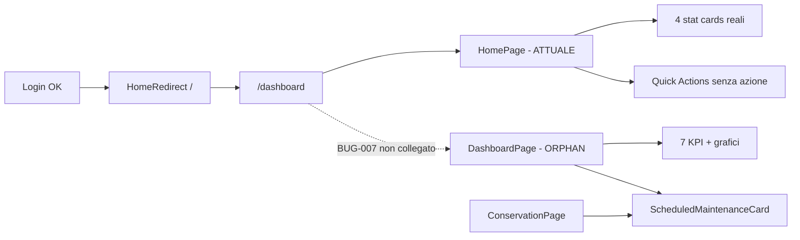

## Report FASE 3 — Area A4 Dashboard + Navigazione

**Data**: 2026-07-05  
**Agente**: A4  
**Modalità**: read-only  
**Priorità area**: P2  
**Esito area**: 🟡 (navigazione funzionale; dashboard reale disallineata da routing e documentazione)

---

### 5.1 Executive summary

| Metrica | Valore |
|---------|--------|
| Elementi verificati | 24 |
| Allineati doc↔codice | 6 |
| Gap critici | 2 |
| Gap medi/bassi | 8 |
| Non verificato (runtime UI) | 2 |
| Verifica DB (supplemento MCP) | 6 tabelle — OK lettura |

**Sintesi in parole semplici**

- **Dove sta la “Home” nell’app**: dopo il login l’utente finisce su `/dashboard`. Quella pagina oggi **non** è la dashboard ricca di grafici (`DashboardPage`), ma una schermata più semplice (`HomePage`) con 4 numeri riassuntivi e azioni rapide finte.
- **Dove sta la dashboard “vera”**: il codice completo (`DashboardPage` + widget KPI, grafici, trend temperature) **esiste** in `src/features/dashboard/` ma **non è collegato al router** — nessun import in `App.tsx`.
- **Navigazione**: barra in basso (`MainLayout`), protezione route (`ProtectedRoute`), redirect onboarding (`OnboardingGuard`) e header (`HeaderButtons`) sono implementati e coerenti con l’archivio Navigation 2025, con eccezioni su pulsanti dev da rimuovere in produzione.
- **Documentazione**: la cartella `02_DASHBOARD` prevista dal README di `APP_DEFINITION` **non esiste**; FASE 2 aveva già segnalato il buco documentale — confermato.

---

### 5.2 Matrice verifica

| Feature/Componente | Doc dice (FASE 2 / Archive) | Codice reale | DB/Schema | Esito |
|--------------------|----------------------------|--------------|-----------|-------|
| **Route `/dashboard`** | Widget task, compliance, temperature trend (codice esiste) | Monta `HomePage`, **non** `DashboardPage` (`App.tsx:134-138`) | N/A | ⚠️ `verificato-gap` |
| **DashboardPage** (KPI, grafici, trend) | Esiste nel codice | Implementata (`DashboardPage.tsx`) con 7 KPI, ComplianceChart, TaskSummary, TemperatureTrend, ScheduledMaintenanceCard | Legge dati via hook da altre aree (no tabella dashboard) | ⚠️ `verificato-gap` — **non montata** |
| **HomePage** (home attuale) | Non documentata | 4 stat cards da hook reali; Quick Actions **senza** `onClick` (`HomePage.tsx:151-187`); Attività Recenti placeholder fisso | N/A | ⚠️ `verificato-gap` |
| **ScheduledMaintenanceCard** | Doc Conservation la descrive; test E2E la cercano in dashboard | Usata in `ConservationPage.tsx:703` e in `DashboardPage.tsx:236`; **assente** in `HomePage` | MCP `supabase-bhm`: tabelle presenti, colonne READ OK (§ supplemento DB) | ⚠️ `verificato-gap` UI — DB lettura OK |
| **useDashboardData** | — | Aggrega hook staff/products/conservation/calendar; `turnover_rate: 85` hardcoded (`useDashboardData.ts:198`); TaskSummary riceve percentuali inventate 60/30/10 (`DashboardPage.tsx:305-327`) | N/A | ⚠️ `verificato-gap` |
| **MultiTenantDashboard service** | Riferito in catalogo DOC | `src/services/dashboard/MultiTenantDashboard.ts` esiste; **zero import** da feature UI | N/A | ⚠️ `verificato-gap` — dead code |
| **MainLayout bottom nav** | MainLayout, tab per ruolo (Archive NAVIGAZIONE) | 6 tab: Home, Conservazione, Attività, Inventario, Impostazioni (admin), Gestione (admin/responsabile) — `MainLayout.tsx:42-81` | N/A | ✅ `verificato-ok` |
| **Route `/liste-spesa`** | Liste spesa: codice presente, doc assente | Definita in `App.tsx:166-179` | `shopping_lists` (via hook inventory) | ⚠️ `verificato-gap` — **no tab** bottom nav |
| **ProtectedRoute** | Protezione auth + ruoli (LOCKED 2025-01-16) | Redirect `/sign-in` se non autenticato; redirect `/onboarding` se `!isAuthorized`; check `requiredRole` — `ProtectedRoute.tsx:188-268` | N/A | ✅ `verificato-ok` |
| **OnboardingGuard** | Redirect se no company (Archive) | Redirect a `/onboarding` se `companiesCount === 0`; skip se `localStorage onboarding-completed === 'true'` — `OnboardingGuard.tsx:40-55` | `companies` / membership (via useAuth) | ✅ `verificato-ok` |
| **Doppio guard onboarding** | Non documentato esplicitamente | Sia `OnboardingGuard` sia `ProtectedRoute` gestiscono redirect onboarding — possibile ridondanza, non bloccante | N/A | ⚠️ `verificato-gap` |
| **HeaderButtons — Alert Attività** | Badge calendario (Archive) | Link a `/attivita` con badge da `useAlertBadge` — `HeaderButtons.tsx:37-53` | eventi calendario (aggregati) | ✅ `verificato-ok` |
| **HeaderButtons — Cancella e Ricomincia** | PRE_PRODUCTION: **da rimuovere** in prod | **Sempre visibile** (non gated su DEV) — `HeaderButtons.tsx:55-113` | Cancella dati operativi multi-tabella via `resetOperationalData` | ❌ `verificato-gap` — blocker pre-prod |
| **HeaderButtons — Riapri Onboarding** | PRE_PRODUCTION: **da rimuovere** in prod | **Sempre visibile** — `HeaderButtons.tsx:115-124` | N/A | ❌ `verificato-gap` — blocker pre-prod |
| **HeaderButtons — Dev buttons** | Solo in DEV (PRE_PRODUCTION) | Visibili solo se `import.meta.env.DEV` — `MainLayout.tsx:111`, `HeaderButtons.tsx:127-162` | N/A | ✅ `verificato-ok` |
| **App.tsx dev console API** | Espone reset/prefill in DEV | `window.resetApp`, `resetTotAndUsers`, etc. — `App.tsx:81-108` | N/A | ✅ `verificato-ok` (DEV only) |
| **HomeRedirect `/`** | — | Loggato → `/dashboard`, altrimenti `/sign-in` — `HomeRedirect.tsx:24` | N/A | ✅ `verificato-ok` |
| **Quick Actions (Home + Dashboard)** | Previste in README 02_DASHBOARD (mai scritto) | Bottoni UI senza handler navigazione — `HomePage.tsx:151-187`, `DashboardPage.tsx:214-231` | N/A | ❌ `verificato-gap` |
| **Attività Recenti (HomePage)** | — | Testo fisso "Nessuna attività recente" — `HomePage.tsx:197-200` | N/A | ⚠️ `verificato-gap` — stub |
| **TemperatureTrend su dashboard** | Doc FASE 2: trend esiste | Solo in `DashboardPage` (non montata); dipende da `useTemperatureReadings` — impattato indirettamente da BUG-005 | `temperature_readings` | ⚠️ `verificato-gap` |
| **02_DASHBOARD conoscenze-definizioni** | Buco documentale FASE 2 | Cartella **inesistente** (solo menzione in `APP_DEFINITION/README.md:26-30`) | N/A | ❌ `verificato-gap` |
| **Archive NAVIGAZIONE_COMPONENTI** | Stato "⏳ Da testare" (2025) | MainLayout/ProtectedRoute marcati LOCKED con test 2025-01-16 — doc obsoleta | N/A | ⚠️ doc obsoleta |
| **Test E2E dashboard** | Dashboard critica | `tests/dashboard-e2e.spec.ts` verifica solo URL/contenuto generico body; **non** widget DashboardPage | N/A | ⚠️ `verificato-gap` — coverage debole |
| **Test conservation → dashboard card** | ScheduledMaintenanceCard in dashboard | `e2e-integration-verification.spec.ts:205-246` cerca card su `/dashboard` — **non la trova** su HomePage attuale | N/A | ⚠️ `verificato-gap` |

---

### 5.3 Bug confermati (nuovi o aggiornati)

> **Nota**: non modificato `BUG_TRACKER.md` (competenza consolidatore A8).

| ID suggerito | Severity | Evidenza | File:Riga |
|--------------|----------|----------|-----------|
| **BUG-007** | HIGH | Route `/dashboard` monta `HomePage` invece di `DashboardPage`; widget avanzati (KPI grid, grafici, trend) non raggiungibili dall’UI | `App.tsx:134-138` vs `DashboardPage.tsx:22` (grep: DashboardPage importato solo nel proprio file) |
| **BUG-008** | MEDIUM | Quick Actions "Registra Temperatura", "Aggiungi Prodotto", "Create Shopping List" / "Completa Mansione" sono bottoni morti (nessun `onClick` / `navigate`) | `HomePage.tsx:151-187`, `DashboardPage.tsx:214-231` |
| **BUG-009** | HIGH (pre-prod) | Pulsanti "Cancella e Ricomincia" e "Onboarding" visibili anche fuori DEV; PRE_PRODUCTION_CLEANUP li marca da rimuovere | `HeaderButtons.tsx:55-124`, `PRE_PRODUCTION_CLEANUP.md:16-36` |
| **BUG-010** | LOW | TaskSummary nella dashboard usa ripartizioni task **fabbricate** (60% Maintenance, 30% Cleaning, 10% Inspection) | `DashboardPage.tsx:305-327` |
| **BUG-011** | LOW | KPI `turnover_rate` hardcoded a 85 in useDashboardData | `useDashboardData.ts:198` |
| **BUG-012** | MEDIUM | Route shopping lists `/liste-spesa` protetta ma assente dalla bottom navigation | `App.tsx:166-179` vs `MainLayout.tsx:42-81` |

---

### 5.4 Documentazione obsoleta

| Path doc | Claim errato | Evidenza | Azione suggerita |
|----------|--------------|----------|------------------|
| `CATALOGO FASE 2` riga 27611 | "Widget task, compliance, temperature trend (codice esiste)" implica home funzionale | Utente vede `HomePage` minimal, non `DashboardPage` | Aggiornare: "codice esiste ma non montato su `/dashboard`" |
| `APP_DEFINITION/README.md` | Struttura `02_DASHBOARD/` con 4 file | Cartella non esiste nel filesystem | Creare area o rimuovere claim dal README |
| `Production/Archive/Knowledge/NAVIGAZIONE/Reports/NAVIGAZIONE_COMPONENTI.md` | MainLayout, ProtectedRoute, App "⏳ Da testare" | File sorgente LOCKED con test passati 2025-01-16 | Marcare storico / aggiornare stato |
| `PRE_PRODUCTION_CLEANUP.md` | Dev buttons da rimuovere prima prod | Cancella e Ricomincia + Onboarding ancora in header | Confermare come debt aperto pre-release |
| Test `e2e-integration-verification.spec.ts` | ScheduledMaintenanceCard "nella dashboard" | Card su ConservationPage, non HomePage | Aggiornare test o collegare DashboardPage |

---

### 5.5 Aggiornamenti catalogo

Proposta append per sezione **FASE 3 — §3.4 Dashboard + Navigazione** (A8 consolida):

| DOC-id / path | Campo | Nuovo `stato_percepito` |
|---------------|-------|-------------------------|
| FASE 2 matrice — Dashboard/Home | verifica codice | `verificato-gap` |
| FASE 2 matrice — Navigazione/Layout | verifica codice | `verificato-gap` (dev buttons prod) |
| `APP_DEFINITION/README.md` — 02_DASHBOARD | esistenza | `verificato-gap` (cartella assente) |
| `Archive/NAVIGAZIONE_COMPONENTI.md` | accuratezza stato test | `verificato-gap` (obsoleto) |
| `src/features/dashboard/DashboardPage.tsx` | utilizzo | `verificato-gap` (orphan) |
| `src/features/auth/HomePage.tsx` | route /dashboard | `verificato-ok` (montata, parziale) |

#### Mini-sezione catalogo (draft §3.4)

```markdown
### 3.4 — Dashboard + Navigazione (2026-07-05)
**Agente**: A4
**Esito area**: 🟡

| Feature | Doc (FASE 2) | Verifica codice | Verifica DB | Stato finale |
|---------|--------------|-----------------|-------------|--------------|
| Home `/dashboard` | Widget KPI/grafici esistono | HomePage semplice montata; DashboardPage orphan | N/A | 🟡 PARZIALE |
| ScheduledMaintenanceCard | In dashboard | Solo ConservationPage (+ DashboardPage non montata) | OK (read) | 🟡 |
| Bottom nav 6 tab | MainLayout | Implementato + role filter | N/A | 🟢 |
| Liste spesa route | Non documentato | Route OK, no tab nav | shopping_lists | 🟡 |
| Dev buttons header | Da rimuovere prod | DEV-only OK; Reset/Onboarding sempre visibili | N/A | 🔴 PRE-PROD |
| OnboardingGuard | Redirect no company | Implementato + localStorage bypass | companies | 🟢 |
| 02_DASHBOARD docs | Buco documentale | Cartella inesistente | N/A | 🔴 DOC |
```

---

### 5.6 Non verificato / fuori scope

- **Runtime browser**: non eseguiti test E2E/login in questa sessione; esito navigazione dedotto da lettura codice + test esistenti.
- **Cross-ref A0 (schema DB)**: vedi § supplemento DB — verificato via MCP; nessuna tabella dashboard dedicata; `temperature_readings` senza colonne Migration 015 (BUG-005) non blocca la **lettura** per ScheduledMaintenanceCard/TemperatureTrend.
- **CompanySwitcher**: citato in scope nav; non analizzato in profondità (delegabile ad A6 o review nav dedicata).
- **SyncStatusBar / offline**: presente in MainLayout, non verificato comportamento offline.
- **Performance dashboard**: test Playwright esistono ma non rieseguiti.
- **Fix codice / rimozione dev buttons**: fuori scope Fase 3.

---

### Appendice — Inventario file area (riferimento rapido)

#### Dashboard (`src/features/dashboard/`)

| File | Ruolo |
|------|-------|
| `DashboardPage.tsx` | Pagina dashboard completa (NON montata) |
| `hooks/useDashboardData.ts` | Aggregazione KPI cross-feature |
| `components/KPICard.tsx` | Card metrica singola |
| `components/ComplianceChart.tsx` | Grafico compliance HACCP |
| `components/TemperatureTrend.tsx` | Trend temperature 7 giorni |
| `components/TaskSummary.tsx` | Riepilogo task settimanali |
| `components/ScheduledMaintenanceCard.tsx` | Manutenzioni programmate (anche in Conservation) |
| `components/__tests__/ScheduledMaintenanceCard.test.tsx` | Unit test card |

#### Navigazione

| File | Ruolo |
|------|-------|
| `src/App.tsx` | Router principale, lazy routes, dev window API |
| `src/components/layouts/MainLayout.tsx` | Layout + bottom nav + header |
| `src/components/HeaderButtons.tsx` | Alert, reset, onboarding, dev tools |
| `src/components/ProtectedRoute.tsx` | Auth + role guard |
| `src/components/OnboardingGuard.tsx` | Redirect onboarding |
| `src/components/HomeRedirect.tsx` | `/` → dashboard o login |
| `src/features/auth/HomePage.tsx` | **Home effettiva** su `/dashboard` |

#### Servizi correlati (non montati)

| File | Ruolo |
|------|-------|
| `src/services/dashboard/MultiTenantDashboard.ts` | Aggregazione multi-azienda — unused |

---

### Diagramma flusso home attuale vs atteso



---

### Supplemento DB (opzionale) — MCP `supabase-bhm` read-only

**Data supplemento**: 2026-07-05  
**Progetto**: `hjteuounjwkadmsbsmdm`  
**Metodo**: `execute_sql` su `information_schema.columns`

#### Ambito

L’area Dashboard **non ha tabelle DB dedicate**: `useDashboardData` aggrega hook di altre feature (staff, products, conservation, shopping).  
La verifica DB riguarda solo le query indirette citate nel report, in particolare **`ScheduledMaintenanceCard`** e i hook che alimentano KPI/trend.

#### Esito per tabella

| Tabella | Usata da | Colonne attese (READ) | Remoto MCP | Esito |
|---------|----------|----------------------|------------|-------|
| `maintenance_tasks` | `useMaintenanceTasks` → SMC | `id`, `company_id`, `conservation_point_id`, `type`, `status`, `next_due`, `last_completed`, `title`, `assigned_to*`, `assignment_type` | Tutte presenti (27 colonne incl. `recurrence_config`) | ✅ |
| `conservation_points` | `useConservationPoints` → SMC | `id`, `company_id`, `name`, `department_id`, `status` | Tutte presenti | ✅ |
| `departments` | JOIN da conservation_points | `id`, `name` | Presenti | ✅ |
| `staff` | JOIN `assigned_to_staff_id` | `id`, `name` | Presenti | ✅ |
| `temperature_readings` | `useTemperatureReadings` → SMC (soddisfazione task temp.) + TemperatureTrend | READ: `id`, `company_id`, `conservation_point_id`, `temperature`, `recorded_at`, `created_at` | Presenti; **assenti** `method`, `notes`, `photo_evidence`, `recorded_by` | ✅ READ / ⚠️ WRITE (BUG-005, area A2) |
| `maintenance_completions` | `useMaintenanceTasks` (complete) | tabella esiste | 13 colonne | ✅ (non usata dal render SMC) |

#### Gap DB rilevati per area A4

| Gap | Impatto su Dashboard/Nav | Severità area A4 |
|-----|--------------------------|------------------|
| Nessuna tabella `dashboard_*` | Atteso — KPI calcolati in app | N/A |
| `temperature_readings` senza colonne Migration 015 | **Non blocca** SMC né trend in sola lettura; blocca insert temperatura (BUG-005, A2) | ⚠️ indiretto |
| Altre tabelle SMC | Schema allineato al client generato (`database.types.ts`) per colonne usate in SELECT | ✅ |

**Conclusione supplemento**: per ScheduledMaintenanceCard e aggregazione KPI in lettura, **schema remoto sufficiente**. Nessun gap DB specifico da aprire sotto A4; BUG-005 resta competenza A2/A0.

---

**Fine report A4** · Prossimo step: consolidatore A8 merge in catalogo + BUG_TRACKER
