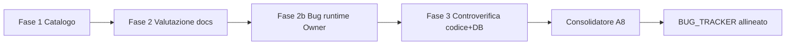

# Guida introduttiva — Agente senior BHM v.2

> **Creato**: 2026-07-05  
> **Audience**: agenti senior, tech lead, owner che devono capire *cosa dice l’app di sé* vs *cosa è realmente vero nel codice e sul DB*  
> **Fonti**: Fase 1–3 documentali + 8 report controverifica (`FASE3_REPORT_A0`…`A7`) + consolidamento A8

---

## 1. Perché esiste questo file

BHM v.2 ha **oltre 1.100 file documentali** e **mesi di report di sessione** (ottobre 2025 → febbraio 2026). Molti dicono “completato”, “blindato”, “salvataggio OK” — ma **non sono stati verificati sul codice** fino alla **Fase 3** (luglio 2026).

Questa guida è il **punto di ingresso unico** per un agente senior che deve:

1. Capire **dove** trovare la verità (catalogo, report, codice, DB live).
2. Sapere **cosa fidarsi** della documentazione e cosa no.
3. Evitare di ripetere lavoro già fatto o di basarsi su claim obsoleti.

**Non sostituisce** i report di dettaglio: li indica e ne sintetizza i messaggi chiave.

---

## 2. Cos’è BHM v.2 (in parole semplici)

**Business HACCP Manager v.2** è una PWA per ristoratori: aiuta a rispettare le norme HACCP (temperature, manutenzioni, scadenze, mansioni, inventario) in modo pratico da cucina.

| Layer | Tecnologia | Ruolo |
|-------|------------|-------|
| **Frontend** | React 18 + TypeScript + Vite | Schermate, form, calendario |
| **Backend** | Supabase (PostgreSQL + Auth) | Dati azienda, utenti, RLS |
| **Storage dati** | Tabelle PostgreSQL sul progetto `hjteuounjwkadmsbsmdm` | Fonte di verità runtime (non i file `.md`) |
| **Documentazione prodotto** | `Production/Conoscenze_congelate/APP_DEFINITION/` | Cosa l’app *dovrebbe* fare |
| **Documentazione meta** | `Production/Conoscenze_congelate/META/` | Catalogo, Fase 3, migration gaps |

L’app **non è in produzione beta stabile**: è in **pre-produzione**. Il codice è spesso **più avanzato** dello schema DB deployato (patch manuali post-restore novembre 2025).

---

## 3. Le tre fasi del lavoro documentale (cronologia)



### Fase 1 — Mappatura (solo inventario)

| | |
|---|---|
| **File** | [`CATALOGO_DOCUMENTALE_BHM_v2_FASE1.md`](./CATALOGO_DOCUMENTALE_BHM_v2_FASE1.md) |
| **Cosa fa** | Elenca **1171 file** (.md, SQL, JSON…) con zona, categoria, data. **Nessun giudizio** su correttezza. |
| **Quando usarlo** | Trovare *se* esiste un report su un argomento; navigare `Production/Archive/` vs `APP_DEFINITION/`. |

### Fase 2 — Valutazione documentale (impressioni, no codice)

| | |
|---|---|
| **Dove** | Stesso catalogo, sezione **FASE 2** (da riga ~27516) |
| **Cosa fa** | Classifica docs 🟢 attuali · 🟡 da approfondire · 🟠 storici · 🔴 obsoleti. Matrice feature “**da documenti**” (login, conservazione, calendario…). |
| **Limite critico** | **Non ha letto il codice.** Un doc che dice “risolto 15-02” può essere vero o falso fino a Fase 3. |

**Pattern temporale utile:**

| Periodo | Affidabilità per stato attuale |
|---------|-------------------------------|
| Ott 2025 (`Production/Archive/`) | 🟠 Processo utile; stato implementazione spesso superato |
| Gen 2026 (`03_CONSERVATION/`) | 🟢 Area più documentata |
| Feb 2026 (`04_CALENDAR/`, Auth CSRF) | 🟢 Più vicino allo stato atteso |
| Gen 2025 (`Info/Agent_Reports`) | 🔴 Storico |

### Fase 2b — Bug confermato dall’Owner

Prima ancora della Fase 3 sistematica, l’Owner ha confermato **BUG-005**: il salvataggio temperatura fallisce con `PGRST204` (colonna `method` assente). Questo ha dimostrato che doc come `ADD_TEMPERATURE_MODAL.md` (“campi salvati OK”) erano **falsi sul DB reale**.

### Fase 3 — Controverifica codice + DB live (luglio 2026)

| | |
|---|---|
| **Metodo** | 8 agenti read-only (A0–A7) + consolidatore A8. Evidenze `file:riga`, MCP Supabase read-only. **Zero modifiche** a `src/` o DB. |
| **Output report** | [`FASE3_REPORT_A0_DB_SCHEMA.md`](./FASE3_REPORT_A0_DB_SCHEMA.md) … [`FASE3_REPORT_A7_SHARED_TYPES.md`](./FASE3_REPORT_A7_SHARED_TYPES.md) |
| **Sintesi nel catalogo** | Sezione **FASE 3** (da riga ~27662) — matrice aggiornata doc vs codice vs DB |
| **Migration gaps** | [`FASE3_MIGRATION_GAPS.md`](./FASE3_MIGRATION_GAPS.md) |
| **Bug allineati** | [`BUG_TRACKER.md`](../../../BUG_TRACKER.md) (root repo) — 30+ bug da Fase 3 |

**Legenda stati Fase 3** (usare sempre questi termini):

| Stato | Significato |
|-------|-------------|
| `verificato-ok` | Doc, codice e DB (se applicabile) allineati |
| `verificato-gap` | Funziona in parte, doc incompleta, o debito non bloccante |
| `verificato-rotto` | Flusso utente bloccato o claim doc falso |
| `non-verificato` | Non controllato in Fase 3 (es. solo runtime Vercel) |

---

## 4. Mappa cartelle — dove vive la “verità”

```
Production/Conoscenze_congelate/
├── META/                          ← INIZIA QUI (questo file + catalogo + Fase 3)
│   ├── GUIDA_INTRODUTTIVA_AGENTE_SENIOR.md   ← questo documento
│   ├── CATALOGO_DOCUMENTALE_BHM_v2_FASE1.md  ← Fase 1+2+3
│   ├── FASE3_REPORT_A*.md         ← dettaglio per area
│   ├── FASE3_MIGRATION_GAPS.md    ← cosa manca sul DB
│   └── HANDOFF_FASE3_*.md         ← contesto processo
├── APP_DEFINITION/                ← “cosa l’app dice di sé”
│   ├── 00_MASTER_INDEX.md         ← checklist ~150 elementi, ~8 documentati
│   ├── 01_AUTH/                   ← 🟢 definito
│   ├── 02_DASHBOARD/              ← ❌ cartella NON esiste
│   ├── 03_CONSERVATION/           ← 🟢 più completo (ma ADD_TEMPERATURE obsoleto)
│   ├── 04_CALENDAR/               ← 🟢 parziale
│   ├── 05_INVENTORY/              ← ❌ non esiste
│   └── 06_SETTINGS/ 07_MANAGEMENT/ ← ❌ non esistono
├── APP_VISION_CAPTURE.md          ← visione prodotto 2025 (utile, non stato tecnico)
└── BETA_PRODUCTION_SPEC.md        ← criteri beta aperti

src/                               ← codice reale
database/migrations/               ← 27 file (molti NON sul DB live)
supabase/migrations/               ← 11 file (subset)
BackupDB/                          ← restore Nov 2025 + patch manuali
```

**Regola d’oro per l’agente senior:**

> Se `APP_DEFINITION` dice una cosa e **FASE 3** dice il contrario → **fidati di FASE 3**.  
> Se FASE 3 non copre un’area → leggi codice + `BUG_TRACKER` + MCP `list_tables` prima di assumere.

---

## 5. Matrice sintetica — cosa dice la doc vs cosa è reale

Legenda esito: 🟢 OK · 🟡 parziale · 🔴 bloccato · ⚪ non documentato

| Area / pagina | Cosa dice la documentazione | Cosa è reale (Fase 3) | Report |
|---------------|----------------------------|------------------------|--------|
| **Login** `/sign-in` | CSRF fix feb 2026 OK; redirect Vercel ancora aperto in doc 07-02 | Login funziona; CSRF **cosmetico** (token non validato al submit); Remember Me UI attiva ma **non collegata**; redirect fixato in codice (`AuthCallbackPage`) | A1 |
| **Registrazione** | Solo via invito (design) | Route `/sign-up` **ancora pubblica** | A1 |
| **Onboarding** 7 step | Acceptance criteria tutti aperti; licenza da rimuovere | Wizard OK; salvataggio `companies` + RLS OK su DB; campo **licenza in UI** ma colonna assente su DB; completamento solo `localStorage` | A1 |
| **Home** `/dashboard` | Widget KPI, trend temperature (codice esiste) | Monta **`HomePage`** semplice, non `DashboardPage` (grafici orphan). Quick Actions **senza click** | A4 |
| **Conservazione** | Area più matura; doc gen–feb “salvataggio temperatura OK” | **Registra temperatura BLOCCATO** (BUG-005). Resto profili/manutenzioni/trigger **OK su DB live** | A2, A0 |
| **Calendario** | Bug weekend risolto 15-02; modal vuoto fix 08-02 | Fix presenti nel codice; doc interna **contraddittoria** su weekend; **editing eventi** = stub | A3 |
| **Inventario** | CRUD base (dedotto da codice) | CRUD hook OK; reparto **stringhe hardcoded** (viola FK); filtri non applicati; scadenze colonne assenti | A5 |
| **Liste spesa** | Feature nel codice | Tabelle OK; **4 RPC assenti** → flusso bloccato (BUG-008) | A5 |
| **Impostazioni** | Attese ma non documentate | UI completa; **3/4 sezioni** incompatibili con schema DB (company estesi, HACCP, notifiche) | A6 |
| **Gestione staff** | CRUD non implementato (BUG_TRACKER) | Lista/toggle OK; create/update/delete = **`console.log`**; DB e RLS **pronti** | A6 |
| **Navigazione** | MainLayout, protected routes | Bottom nav OK; pulsanti **“Cancella e Ricomincia”** e **“Riapri Onboarding”** visibili anche in prod | A4 |
| **Tipi / servizi** | ~50 mismatch stimati | **163 errori TypeScript**; `database.types.ts` indietro vs DB live; molti servizi “B.9/B.10” **dead code** | A7 |

---

## 6. I tre disallineamenti strutturali (capire il sistema)

### 6.1 Codice più avanzato del DB

Il DB live deriva da **restore novembre 2025** + patch manuali (`BackupDB/apply-missing-schema-migrations.sql`). Il codice invia campi da migration che **non sono state applicate**:

| Esempio | Codice invia | DB live ha | Bug |
|---------|--------------|------------|-----|
| Temperatura | `method`, `notes`, `photo_evidence`, `recorded_by` | Solo 6 colonne base | **BUG-005** CRITICAL |
| Liste spesa | RPC `create_shopping_list_with_items` ecc. | RPC assenti | **BUG-008** CRITICAL |
| Impostazioni azienda | `phone`, `vat_number`, `license_number` | Solo `name`, `address`, `email`… | **BUG-011** |
| Notifiche | tabella `notification_preferences` | Tabella **inesistente** | **BUG-013** |

**Dove guardare**: [`FASE3_MIGRATION_GAPS.md`](./FASE3_MIGRATION_GAPS.md) — priorità P0: Migration **015** + RPC shopping **007**.

### 6.2 Documentazione che anticipa o mente lo stato

| File doc | Claim | Realtà Fase 3 |
|----------|-------|---------------|
| `03_CONSERVATION/Conoscenze-Definizioni/ADD_TEMPERATURE_MODAL.md` | Campi salvati OK | Insert **fallisce** su DB live |
| `03_CONSERVATION/00_MASTER_INDEX.md` | Migration 015 applicata | **Non applicata** live |
| `04_CALENDAR/00_MASTER_INDEX.md` | Weekend “parzialmente risolto” | Report 15-02 + codice = **risolto** |
| `04_CALENDAR/conoscenze-definizioni/` | “PRODUCTION-READY” | Editing eventi stub, test mancanti |
| `ONBOARDING_FLOW.md` | Acceptance `[ ]` tutti aperti | Implementazione parziale; stato “completato” solo client |

**Azione suggerita**: marcare questi file `verificato-rotto` o `verificato-gap` in testa al documento quando si aggiornano.

### 6.3 Tipi TypeScript non proteggono

`database.types.ts` riflette ancora lo **schema base** del restore. I tipi custom (`conservation.ts`, `client.ts`) descrivono un mondo **più ricco**. Il compilatore non blocca insert con colonne extra → i bug esplodono a **runtime** su Supabase (`PGRST204`).

- **163 errori** `npm run type-check` (A7)
- Cast `as Company`, `as HACCPConfig` in Settings mascherano il problema

---

## 7. Bug critici — cosa blocca l’utente oggi

Ordine di impatto reale (post-Fase 3):

| Priorità | ID | Area | Effetto utente |
|----------|-----|------|----------------|
| **P0** | BUG-005 | Conservation | Non può **salvare una lettura temperatura** |
| **P0** | BUG-008 | Shopping | **Liste spesa** non funzionano (RPC mancanti) |
| **P1** | BUG-011–014 | Settings | Salvataggio impostazioni azienda/HACCP/notifiche/ruoli **fallisce o è fuorviante** |
| **P1** | BUG-009–010, 021–022 | Inventory | Reparto prodotto errato; scadenze/filtri rotti |
| **P1** | BUG-015 | Management | Non può **creare/modificare staff** dalla UI (solo console.log) |
| **P1** | BUG-007 | Dashboard | Utente vede **Home semplificata**, non dashboard con grafici |
| **P2** | BUG-016 | Navigation | Pulsanti pericolosi in header anche fuori sviluppo |
| **P2** | BUG-017–020 | Auth | Remember Me, CSRF, sign-up pubblico, licenza fantasma |

Elenco completo e TODO codice: [`BUG_TRACKER.md`](../../../BUG_TRACKER.md).

---

## 8. Aree “mature” vs “buco documentale”

### Documentate e in gran parte verificate (Fase 3)

| Area | Cartella doc | Stato reale | Note |
|------|--------------|-------------|------|
| Auth + Onboarding | `01_AUTH/` | 🟡 | Flusso core OK; hardening incompleto |
| Conservation | `03_CONSERVATION/` | 🔴 su temperatura, 🟢 su resto | Doc temperatura **da riscrivere** |
| Calendar | `04_CALENDAR/` | 🟡 | Architettura solida; editing mancante |

### Buco documentale confermato (cartelle previste ma assenti)

| Area prevista da `00_MASTER_INDEX` | Esiste `APP_DEFINITION/0X_*`? | Stato codice |
|-----------------------------------|--------------------------------|--------------|
| `02_DASHBOARD` | ❌ | Codice split HomePage / DashboardPage |
| `05_INVENTORY` | ❌ | Hook presenti, gap DB/UI |
| `06_SETTINGS` | ❌ | UI vs schema disallineati |
| `07_MANAGEMENT` | ❌ (in index come componenti) | Staff CRUD stub |

**Per l’agente senior**: prima di documentare una feature, controllare se Fase 3 ha già un report; non duplicare analisi.

---

## 9. Percorso di lettura consigliato (30–60 minuti)

1. **Questo file** — quadro generale.
2. **Catalogo FASE 3** — sezione `3.0 Executive summary` in [`CATALOGO_DOCUMENTALE_BHM_v2_FASE1.md`](./CATALOGO_DOCUMENTALE_BHM_v2_FASE1.md) (~riga 27662).
3. **`BUG_TRACKER.md`** — cosa è aperto e severity.
4. **Report area del tuo task** — es. lavori su Conservation → [`FASE3_REPORT_A2_CONSERVATION.md`](./FASE3_REPORT_A2_CONSERVATION.md) + cross-ref A0.
5. **`APP_DEFINITION/<area>/conoscenze-definizioni/`** — solo **dopo** Fase 3, per capire intento prodotto (non stato).
6. **Codice** — `src/features/<area>/` con grep su TODO e `supabase.from(`.

**Non partire da** `Production/Archive/Sessione_di_lavoro/` per stato attuale: è **storico ottobre 2025**.

---

## 10. Vincoli operativi per agenti che implementano fix

Dopo Fase 3 (solo analisi), la fase implementativa deve rispettare:

| Ordine | Azione | Riferimento |
|--------|--------|-------------|
| 1 | Applicare Migration **015** + aggiornare `apply-missing-schema-migrations.sql` | A0, `FASE3_MIGRATION_GAPS` |
| 2 | Deploy RPC shopping + policies | A5, migration 007 |
| 3 | Rigenerare `database.types.ts` da schema live | A7, BUG-DB-002 |
| 4 | Allineare Settings payload ↔ schema | A6 |
| 5 | Collegare `DashboardPage` o documentare scelta `HomePage` | A4 |
| 6 | Rivalutare BUG-006 (modal temperatura) **dopo** fix 015 | A2 |

**Non** assumere che un file in `database/migrations/` sia sul remoto: `list_migrations` su Supabase CLI era **vuoto** (schema da patch manuali).

---

## 11. Glossario rapido — componenti e storage

Spiegazione in linguaggio semplice per le aree più toccate dalla Fase 3.

### Conservation — `AddTemperatureModal` + `temperature_readings`

- **Dove nell’app**: tab **Conservazione** → pulsante registra temperatura su un punto freddo.
- **Cosa fa il componente**: raccoglie temperatura, metodo (termometro), note, foto; chiama `useTemperatureReadings` per salvare.
- **Storage (`temperature_readings`)**: tabella PostgreSQL con una riga per ogni lettura. **Oggi sul DB live** ha solo: `id`, `company_id`, `conservation_point_id`, `temperature`, `recorded_at`, `created_at`. Il codice prova a scrivere anche `method`, `notes`, `photo_evidence`, `recorded_by` → **errore 400**.

### Shopping — `shoppingListService` + RPC

- **Dove nell’app**: route `/liste-spesa` (non in bottom nav).
- **Cosa fa**: crea liste, spunta articoli, completa ordine via funzioni PostgreSQL (RPC).
- **Storage**: tabelle `shopping_lists` e `shopping_list_items` **esistono**; le **funzioni** `create_shopping_list_with_items` ecc. **no** → l’app non può usare il flusso previsto.

### Settings — `CompanyConfiguration`, `HACCPSettings`, `NotificationPreferences`

- **Dove nell’app**: tab **Impostazioni** (solo admin).
- **Storage**:
  - `companies` — dati base azienda (nome, indirizzo, email…); **non** ha P.IVA, telefono, licenza che la UI mostra.
  - `haccp_configurations` — configurazioni HACCP in JSON con `configuration_name` / `settings`; la UI invia un oggetto **flat** incompatibile.
  - `notification_preferences` — tabella **non esiste** sul DB live.

### Dashboard — `HomePage` vs `DashboardPage`

- **Dove nell’app**: dopo login, URL `/dashboard`.
- **Cosa vede l’utente**: `HomePage` — 4 numeri e pulsanti rapidi **non collegati**.
- **Cosa esiste ma non si vede**: `DashboardPage` con grafici compliance, trend temperature, KPI (orphan nel router).

### Tipi — `database.types.ts`

- **Cosa è**: “fotografia” del DB per TypeScript, generata da Supabase.
- **Problema**: fotografia **vecchia**; il DB live ha colonne in più (profili conservazione, `open_weekdays`) che il file non elenca → falsi negativi in analisi e 163 errori TS altrove.

---

## 12. Artefatti collegati (indice rapido)

| File | Ruolo |
|------|--------|
| [`CATALOGO_DOCUMENTALE_BHM_v2_FASE1.md`](./CATALOGO_DOCUMENTALE_BHM_v2_FASE1.md) | Inventario + FASE 2 + FASE 3 consolidate |
| [`HANDOFF_FASE3_CONTROVERIFICA_CODICE.md`](./HANDOFF_FASE3_CONTROVERIFICA_CODICE.md) | Perché è nata la Fase 3, template checklist |
| [`FASE3_MIGRATION_GAPS.md`](./FASE3_MIGRATION_GAPS.md) | Migration mancanti sul remoto |
| [`FASE3_REPORT_A0_DB_SCHEMA.md`](./FASE3_REPORT_A0_DB_SCHEMA.md) … **A7** | Dettaglio per area |
| [`BUG_TRACKER.md`](../../../BUG_TRACKER.md) | Bug aperti, TODO codice, tech debt |
| [`APP_DEFINITION/00_MASTER_INDEX.md`](../APP_DEFINITION/00_MASTER_INDEX.md) | Checklist documentazione prodotto (~8/150 fatti) |
| `HANDOFF_FASE3` + piano Cursor locale `fase_3_controverifica_parallela_cdc56762.plan.md` | Orchestrazione 8 agenti A0–A7 + A8 (runbook) |

---

## 13. Messaggio finale per l’agente senior

**L’app “dice di sé”** soprattutto in `APP_DEFINITION` e nei report di sessione gen–feb 2026: conservazione quasi completa, calendario in recovery, auth hardened.

**La realtà verificata (Fase 3)** è più sfumata:

- **Conservation**: eccellente su profili e manutenzioni; **core temperatura rotto** sul DB deployato.
- **Calendar**: buon codice; doc da riallineare; editing assente.
- **Auth/Onboarding**: usabile; non ancora “blindato” come la spec 2025.
- **Dashboard, Inventory, Settings, Shopping**: codice presente ma **doc assente** e/o **schema DB indietro** — alto rischio di assumere “funziona” dai nomi dei componenti.

Quando inizi un task: **(1)** BUG_TRACKER, **(2)** report FASE3 dell’area, **(3)** codice, **(4)** doc prodotto per intento UX — in quell’ordine.

---

**Ultimo aggiornamento**: 2026-07-05 · Allineato a consolidamento A8 e catalogo FASE 3
