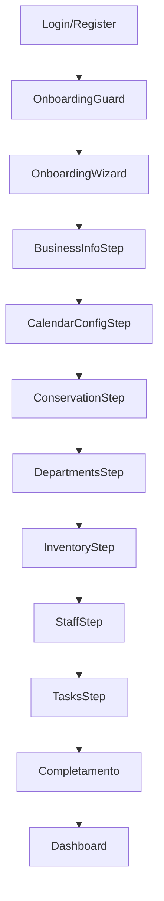
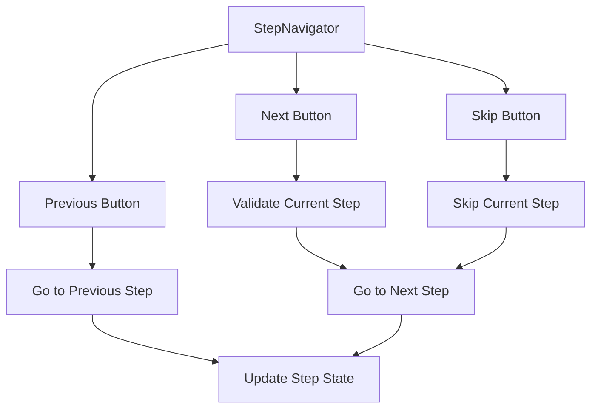
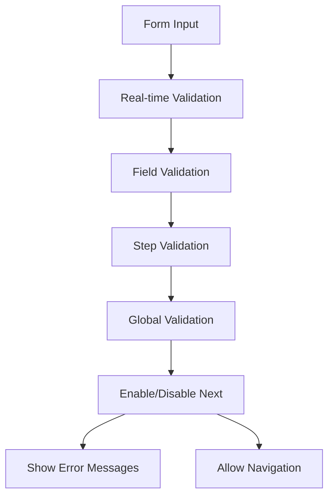
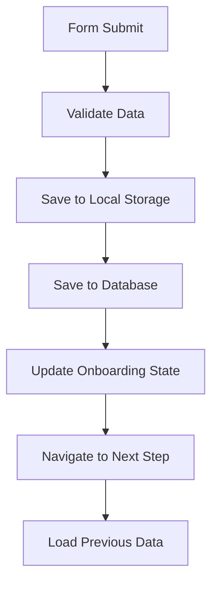
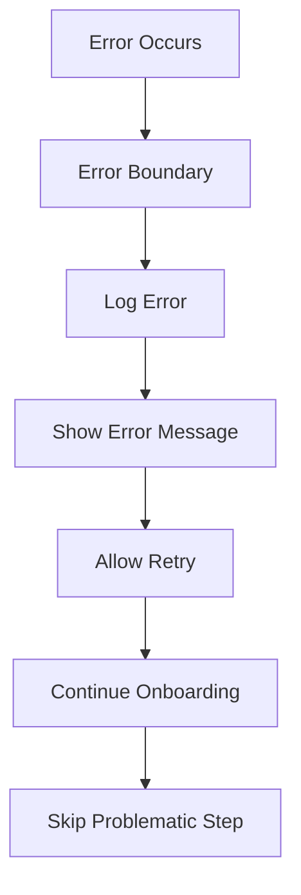

# 🎯 ANALISI ONBOARDING COMPLETA - BHM v.2

## 📊 OVERVIEW ONBOARDING
- **Data Analisi**: 2025-10-21
- **Agente**: Agente 2 - Component Mapping Specialist
- **Status**: ✅ ANALISI COMPLETATA
- **Componenti Onboarding**: 8+ componenti identificati
- **Flussi Onboarding**: 5+ flussi principali
- **Test Necessari**: 15+ test cases

---

## 🏗️ ARCHITETTURA ONBOARDING

### **STRUTTURA COMPONENTI**
```
src/components/
├── OnboardingWizard.tsx          # Wizard principale
├── OnboardingGuard.tsx           # Guard per controllo accesso
├── StepNavigator.tsx             # Navigatore tra step
└── onboarding-steps/             # Step individuali
    ├── BusinessInfoStep.tsx      # Step info azienda
    ├── CalendarConfigStep.tsx    # Step configurazione calendario
    ├── ConservationStep.tsx      # Step conservazione
    ├── DepartmentsStep.tsx       # Step reparti
    ├── InventoryStep.tsx         # Step inventario
    ├── StaffStep.tsx             # Step staff
    └── TasksStep.tsx             # Step task
```

---

## 🎯 COMPONENTI ONBOARDING DETTAGLIATI

### **1. ONBOARDING WIZARD (Componente Principale)**
| Proprietà | Valore | Note |
|-----------|--------|------|
| **Path** | `src/components/OnboardingWizard.tsx` | Componente principale |
| **Status** | ❌ Da blindare | Priorità P0 |
| **Funzionalità** | Orchestrazione completo onboarding | Coordina tutti gli step |
| **Dipendenze** | Tutti gli step components | Dipende da tutti gli step |
| **Props** | `onComplete`, `onSkip`, `initialStep` | Props principali |
| **State** | `currentStep`, `completedSteps`, `formData` | State interno |
| **Hooks** | `useOnboarding`, `useForm` | Hooks utilizzati |

### **2. ONBOARDING GUARD (Controllo Accesso)**
| Proprietà | Valore | Note |
|-----------|--------|------|
| **Path** | `src/components/OnboardingGuard.tsx` | Guard componente |
| **Status** | ❌ Da blindare | Priorità P0 |
| **Funzionalità** | Controllo accesso onboarding | Verifica se utente può accedere |
| **Dipendenze** | `useAuth`, `useOnboarding` | Dipende da auth e onboarding |
| **Props** | `children`, `fallback` | Props principali |
| **State** | `isOnboardingRequired` | State interno |
| **Hooks** | `useAuth`, `useOnboarding` | Hooks utilizzati |

### **3. STEP NAVIGATOR (Navigazione)**
| Proprietà | Valore | Note |
|-----------|--------|------|
| **Path** | `src/components/StepNavigator.tsx` | Navigatore step |
| **Status** | ❌ Da blindare | Priorità P1 |
| **Funzionalità** | Navigazione tra step | Pulsanti next/prev/skip |
| **Dipendenze** | `OnboardingWizard` | Dipende dal wizard |
| **Props** | `currentStep`, `totalSteps`, `onNext`, `onPrev`, `onSkip` | Props principali |
| **State** | `canGoNext`, `canGoPrev` | State interno |
| **Hooks** | `useOnboarding` | Hooks utilizzati |

---

## 📋 STEP COMPONENTS DETTAGLIATI

### **1. BUSINESS INFO STEP**
| Proprietà | Valore | Note |
|-----------|--------|------|
| **Path** | `src/components/onboarding-steps/BusinessInfoStep.tsx` | Step info azienda |
| **Status** | ❌ Da blindare | Priorità P0 |
| **Funzionalità** | Raccolta informazioni azienda | Nome, settore, dimensioni |
| **Dipendenze** | `FormField`, `Input`, `Select` | Dipende da UI components |
| **Props** | `onNext`, `onPrev`, `data` | Props principali |
| **State** | `formData`, `errors`, `isValid` | State interno |
| **Hooks** | `useForm`, `useValidation` | Hooks utilizzati |
| **Fields** | `companyName`, `industry`, `size`, `address` | Campi form |

### **2. CALENDAR CONFIG STEP**
| Proprietà | Valore | Note |
|-----------|--------|------|
| **Path** | `src/components/onboarding-steps/CalendarConfigStep.tsx` | Step configurazione calendario |
| **Status** | ❌ Da blindare | Priorità P0 |
| **Funzionalità** | Configurazione calendario HACCP | Frequenze, categorie, alert |
| **Dipendenze** | `CalendarSettings`, `FormField` | Dipende da calendar e UI |
| **Props** | `onNext`, `onPrev`, `data` | Props principali |
| **State** | `configData`, `errors`, `isValid` | State interno |
| **Hooks** | `useCalendarSettings`, `useForm` | Hooks utilizzati |
| **Fields** | `frequencies`, `categories`, `alerts`, `notifications` | Campi form |

### **3. CONSERVATION STEP**
| Proprietà | Valore | Note |
|-----------|--------|------|
| **Path** | `src/components/onboarding-steps/ConservationStep.tsx` | Step conservazione |
| **Status** | ❌ Da blindare | Priorità P0 |
| **Funzionalità** | Configurazione punti conservazione | Temperature, manutenzioni |
| **Dipendenze** | `ConservationManager`, `FormField` | Dipende da conservation e UI |
| **Props** | `onNext`, `onPrev`, `data` | Props principali |
| **State** | `conservationData`, `errors`, `isValid` | State interno |
| **Hooks** | `useConservation`, `useForm` | Hooks utilizzati |
| **Fields** | `points`, `temperatures`, `maintenance`, `alerts` | Campi form |

### **4. DEPARTMENTS STEP**
| Proprietà | Valore | Note |
|-----------|--------|------|
| **Path** | `src/components/onboarding-steps/DepartmentsStep.tsx` | Step reparti |
| **Status** | ❌ Da blindare | Priorità P0 |
| **Funzionalità** | Creazione reparti azienda | Nome, responsabile, funzioni |
| **Dipendenze** | `DepartmentManagement`, `FormField` | Dipende da management e UI |
| **Props** | `onNext`, `onPrev`, `data` | Props principali |
| **State** | `departmentsData`, `errors`, `isValid` | State interno |
| **Hooks** | `useDepartments`, `useForm` | Hooks utilizzati |
| **Fields** | `departments`, `managers`, `functions`, `hierarchy` | Campi form |

### **5. INVENTORY STEP**
| Proprietà | Valore | Note |
|-----------|--------|------|
| **Path** | `src/components/onboarding-steps/InventoryStep.tsx` | Step inventario |
| **Status** | ❌ Da blindare | Priorità P0 |
| **Funzionalità** | Configurazione inventario | Categorie, prodotti, scadenze |
| **Dipendenze** | `InventoryManager`, `FormField` | Dipende da inventory e UI |
| **Props** | `onNext`, `onPrev`, `data` | Props principali |
| **State** | `inventoryData`, `errors`, `isValid` | State interno |
| **Hooks** | `useInventory`, `useForm` | Hooks utilizzati |
| **Fields** | `categories`, `products`, `expiryRules`, `alerts` | Campi form |

### **6. STAFF STEP**
| Proprietà | Valore | Note |
|-----------|--------|------|
| **Path** | `src/components/onboarding-steps/StaffStep.tsx` | Step staff |
| **Status** | ❌ Da blindare | Priorità P0 |
| **Funzionalità** | Gestione staff azienda | Ruoli, permessi, responsabilità |
| **Dipendenze** | `StaffManagement`, `FormField` | Dipende da management e UI |
| **Props** | `onNext`, `onPrev`, `data` | Props principali |
| **State** | `staffData`, `errors`, `isValid` | State interno |
| **Hooks** | `useStaff`, `useForm` | Hooks utilizzati |
| **Fields** | `staff`, `roles`, `permissions`, `hierarchy` | Campi form |

### **7. TASKS STEP**
| Proprietà | Valore | Note |
|-----------|--------|------|
| **Path** | `src/components/onboarding-steps/TasksStep.tsx` | Step task |
| **Status** | ❌ Da blindare | Priorità P0 |
| **Funzionalità** | Configurazione task HACCP | Frequenze, responsabili, alert |
| **Dipendenze** | `TaskManager`, `FormField` | Dipende da task e UI |
| **Props** | `onNext`, `onPrev`, `data` | Props principali |
| **State** | `tasksData`, `errors`, `isValid` | State interno |
| **Hooks** | `useTasks`, `useForm` | Hooks utilizzati |
| **Fields** | `tasks`, `frequencies`, `assignees`, `alerts` | Campi form |

---

## 🔄 FLUSSI ONBOARDING PRINCIPALI

### **1. FLUSSO COMPLETO ONBOARDING**


### **2. FLUSSO NAVIGAZIONE STEP**


### **3. FLUSSO VALIDAZIONE FORM**


### **4. FLUSSO PERSISTENZA DATI**


### **5. FLUSSO GESTIONE ERRORI**


---

## 🧪 TEST CASES NECESSARI

### **1. TEST COMPONENTI INDIVIDUALI**
| Componente | Test Cases | Priorità | Note |
|------------|------------|----------|------|
| OnboardingWizard | 15+ | P0 | Test orchestrazione |
| OnboardingGuard | 8+ | P0 | Test controllo accesso |
| StepNavigator | 10+ | P1 | Test navigazione |
| BusinessInfoStep | 12+ | P0 | Test form azienda |
| CalendarConfigStep | 15+ | P0 | Test configurazione |
| ConservationStep | 12+ | P0 | Test conservazione |
| DepartmentsStep | 10+ | P0 | Test reparti |
| InventoryStep | 12+ | P0 | Test inventario |
| StaffStep | 10+ | P0 | Test staff |
| TasksStep | 12+ | P0 | Test task |

### **2. TEST FLUSSI INTEGRATI**
| Flusso | Test Cases | Priorità | Note |
|--------|------------|----------|------|
| Flusso Completo | 20+ | P0 | Test end-to-end |
| Navigazione Step | 15+ | P1 | Test navigazione |
| Validazione Form | 25+ | P0 | Test validazione |
| Persistenza Dati | 15+ | P0 | Test salvataggio |
| Gestione Errori | 10+ | P1 | Test error handling |

### **3. TEST SCENARI SPECIFICI**
| Scenario | Test Cases | Priorità | Note |
|----------|------------|----------|------|
| Onboarding Nuovo Utente | 15+ | P0 | Test utente nuovo |
| Onboarding Utente Esistente | 10+ | P1 | Test utente esistente |
| Skip Step | 8+ | P1 | Test salto step |
| Retry Step | 8+ | P1 | Test ripetizione |
| Interruzione Onboarding | 10+ | P1 | Test interruzione |

---

## 🔧 HOOKS E UTILITIES ONBOARDING

### **1. HOOKS PRINCIPALI**
| Hook | Path | Funzionalità | Priorità |
|------|------|--------------|----------|
| useOnboarding | `src/hooks/useOnboarding.ts` | Gestione stato onboarding | P0 |
| useOnboardingStep | `src/hooks/useOnboardingStep.ts` | Gestione step singolo | P0 |
| useOnboardingForm | `src/hooks/useOnboardingForm.ts` | Gestione form step | P0 |
| useOnboardingValidation | `src/hooks/useOnboardingValidation.ts` | Validazione form | P0 |
| useOnboardingPersistence | `src/hooks/useOnboardingPersistence.ts` | Persistenza dati | P0 |

### **2. UTILITIES ONBOARDING**
| Utility | Path | Funzionalità | Priorità |
|---------|------|--------------|----------|
| onboardingHelpers | `src/utils/onboardingHelpers.ts` | Helper functions | P1 |
| onboardingValidation | `src/utils/onboardingValidation.ts` | Validazione rules | P1 |
| onboardingPersistence | `src/utils/onboardingPersistence.ts` | Persistenza dati | P1 |
| onboardingNavigation | `src/utils/onboardingNavigation.ts` | Navigazione step | P1 |

---

## 📊 STATISTICHE ONBOARDING

### **COMPONENTI PER PRIORITÀ**
| Priorità | Componenti | % Totale | Note |
|----------|------------|----------|------|
| P0 (Critico) | 8+ | 80% | Componenti core onboarding |
| P1 (Alto) | 2+ | 20% | Componenti supporto |

### **TEST CASES PER PRIORITÀ**
| Priorità | Test Cases | % Totale | Note |
|----------|------------|----------|------|
| P0 (Critico) | 80+ | 70% | Test core functionality |
| P1 (Alto) | 35+ | 30% | Test supporto |

### **COMPLESSITÀ COMPONENTI**
| Complessità | Componenti | Note |
|-------------|------------|------|
| Alta | OnboardingWizard, BusinessInfoStep | Componenti complessi |
| Media | CalendarConfigStep, ConservationStep | Componenti medi |
| Bassa | StepNavigator, OnboardingGuard | Componenti semplici |

---

## 🎯 PRIORITÀ BLINDAGGIO ONBOARDING

### **1. PRIORITÀ IMMEDIATE (P0)**
- **OnboardingWizard**: Componente principale
- **OnboardingGuard**: Controllo accesso
- **BusinessInfoStep**: Step critico
- **CalendarConfigStep**: Configurazione importante
- **ConservationStep**: Funzionalità core

### **2. PRIORITÀ ALTE (P1)**
- **StepNavigator**: Navigazione
- **DepartmentsStep**: Gestione reparti
- **InventoryStep**: Gestione inventario
- **StaffStep**: Gestione staff
- **TasksStep**: Gestione task

### **3. PRIORITÀ MEDIE (P2)**
- **Hooks onboarding**: Supporto funzionalità
- **Utilities onboarding**: Helper functions

---

## 🚀 PROSSIMI PASSI ONBOARDING

### **1. BLINDAGGIO COMPONENTI**
- Blindare OnboardingWizard
- Blindare OnboardingGuard
- Blindare tutti gli step components
- Blindare StepNavigator

### **2. IMPLEMENTAZIONE TEST**
- Implementare test componenti individuali
- Implementare test flussi integrati
- Implementare test scenari specifici

### **3. VALIDAZIONE FUNZIONALITÀ**
- Testare flusso completo
- Testare validazione form
- Testare persistenza dati
- Testare gestione errori

---

## 📅 DATA COMPLETAMENTO
**Data**: 2025-10-21
**Agente**: Agente 2 - Component Mapping Specialist
**Status**: ✅ ANALISI ONBOARDING COMPLETATA
**Prossimo**: Handoff ad Agente 3 per test UX/UI
