# 🏗️ SYSTEM ARCHITECTURE DIAGRAM - BHM v.2

**Data**: 2025-10-23  
**Agente**: Agente 2B - Systems Blueprint Architect  
**Sessione**: Blindatura Completa Login e Onboarding

---

## 📊 ARCHITETTURA SISTEMA COMPLETA

```mermaid
graph TB
    %% =============================================
    %% FRONTEND LAYER
    %% =============================================
    subgraph "🖥️ FRONTEND LAYER"
        subgraph "🔐 AUTHENTICATION"
            LP[LoginPage.tsx<br/>80% test coverage<br/>🔴 Critico]
            RP[RegisterPage.tsx<br/>80% test coverage<br/>🟡 Alto]
            FP[ForgotPasswordPage.tsx<br/>🟢 Medio]
            AI[AcceptInvitePage.tsx<br/>🟡 Alto]
            AC[AuthCallbackPage.tsx<br/>100% test coverage<br/>🟢 Medio]
        end
        
        subgraph "🎯 ONBOARDING WIZARD"
            OW[OnboardingWizard.tsx<br/>Completamente blindata<br/>🔴 Critico]
            BI[BusinessInfoStep.tsx<br/>🔴 Critico]
            DS[DepartmentsStep.tsx<br/>🟡 Alto]
            SS[StaffStep.tsx<br/>🔴 Critico]
            CS[ConservationStep.tsx<br/>🔴 Critico]
            TS[TasksStep.tsx<br/>🟡 Alto]
            IS[InventoryStep.tsx<br/>🟡 Alto]
            CC[CalendarConfigStep.tsx<br/>🟡 Alto]
        end
        
        subgraph "🔧 HOOKS & SERVICES"
            UA[useAuth.ts<br/>100% test coverage<br/>Completamente blindato]
            UR[useRealtime.ts]
            UAT[useActivityTracking.ts]
            UI[useInvites.ts]
            IS[inviteService.ts]
            ATS[activityTrackingService.ts]
        end
    end

    %% =============================================
    %% API LAYER
    %% =============================================
    subgraph "🔌 API LAYER"
        subgraph "📡 SUPABASE EDGE FUNCTIONS"
            SIE[send-invite-email<br/>Invio email inviti]
            RM[remember-me<br/>Gestione sessioni estese]
        end
        
        subgraph "🔐 SUPABASE AUTH"
            SA[auth.signInWithPassword<br/>Login standard]
            SU[auth.signUp<br/>Registrazione]
            SAI[auth.admin.inviteUserByEmail<br/>Invio inviti]
            SAU[auth.admin.updateUserById<br/>Gestione metadati]
        end
        
        subgraph "📊 SUPABASE REST API"
            SR[Supabase REST API<br/>CRUD operations]
            SG[Supabase GraphQL<br/>Query complesse]
        end
    end

    %% =============================================
    %% DATABASE LAYER
    %% =============================================
    subgraph "🗄️ DATABASE LAYER"
        subgraph "🔐 AUTH TABLES"
            AU[auth.users<br/>Utenti autenticati]
            CM[company_members<br/>2 record<br/>Relazione N:N]
            US[user_sessions<br/>2 record<br/>Sessioni attive]
            IT[invite_tokens<br/>2 record<br/>Token invito]
            UP[user_profiles<br/>0 record<br/>Migrazione Clerk]
        end
        
        subgraph "🏢 BUSINESS TABLES"
            C[companies<br/>7 record<br/>Aziende registrate]
            D[departments<br/>0 record<br/>Dipartimenti]
            S[staff<br/>0 record<br/>Personale]
            CP[conservation_points<br/>0 record<br/>Punti HACCP]
            T[tasks<br/>0 record<br/>Attività]
            MT[maintenance_tasks<br/>0 record<br/>Manutenzione]
            P[products<br/>0 record<br/>Inventario]
            PC[product_categories<br/>0 record<br/>Categorie]
        end
        
        subgraph "📊 TRACKING TABLES"
            UAL[user_activity_logs<br/>9 record<br/>Log attività]
            AL[audit_logs<br/>0 record<br/>Audit trail]
            TC[task_completions<br/>0 record<br/>Completamenti]
            PEC[product_expiry_completions<br/>0 record<br/>Scadenze]
            SS[security_settings<br/>14 record<br/>Impostazioni]
        end
        
        subgraph "📅 CALENDAR TABLES"
            E[events<br/>0 record<br/>Eventi calendario]
            CCS[company_calendar_settings<br/>0 record<br/>Config calendario]
            SL[shopping_lists<br/>0 record<br/>Liste spesa]
            SLI[shopping_list_items<br/>0 record<br/>Elementi liste]
        end
    end

    %% =============================================
    %% CONNECTIONS
    %% =============================================
    
    %% Frontend to API
    LP --> SA
    RP --> SU
    AI --> SAI
    OW --> SR
    
    %% Hooks to Services
    UA --> SA
    UA --> SU
    UI --> IS
    UAT --> ATS
    
    %% Services to Edge Functions
    IS --> SIE
    UA --> RM
    
    %% Edge Functions to Auth
    SIE --> SAI
    RM --> SAU
    
    %% API to Database
    SA --> AU
    SU --> AU
    SAI --> IT
    SR --> C
    SR --> D
    SR --> S
    SR --> CP
    SR --> T
    SR --> P
    
    %% Database Relationships
    AU --> CM
    C --> CM
    CM --> US
    IT --> C
    C --> D
    C --> S
    C --> CP
    C --> T
    C --> P
    D --> T
    CP --> T
    S --> T

    %% =============================================
    %% STYLING
    %% =============================================
    classDef critical fill:#ff6b6b,stroke:#d63031,stroke-width:3px,color:#fff
    classDef high fill:#fdcb6e,stroke:#e17055,stroke-width:2px,color:#000
    classDef medium fill:#6c5ce7,stroke:#5f3dc4,stroke-width:2px,color:#fff
    classDef database fill:#00b894,stroke:#00a085,stroke-width:2px,color:#fff
    classDef api fill:#74b9ff,stroke:#0984e3,stroke-width:2px,color:#fff
    
    class LP,OW,BI,SS,CS critical
    class RP,AI,DS,TS,IS,CC high
    class FP,AC medium
    class AU,CM,US,IT,UP,C,D,S,CP,T,MT,P,PC,UAL,AL,TC,PEC,SS,E,CCS,SL,SLI database
    class SIE,RM,SA,SU,SAI,SAU,SR,SG api
```



---

## 🎯 COMPONENTI CRITICI IDENTIFICATI

### **🔴 PRIORITÀ CRITICA** (Blindatura Immediata)
1. **LoginPage.tsx** - Accesso principale applicazione
   - **Status**: 80% test coverage, parzialmente blindata
   - **Implementazioni**: 22 decisioni approvate da implementare
   - **Dipendenze**: useAuth, CSRF, Remember Me

2. **OnboardingWizard.tsx** - Configurazione iniziale utente
   - **Status**: Completamente blindata
   - **Funzionalità**: 7 step wizard, localStorage, prefill
   - **Dipendenze**: Tutti gli step components

3. **BusinessInfoStep.tsx** - Dati azienda critici
   - **Status**: Da valutare
   - **Funzionalità**: Creazione company, dati business
   - **Dipendenze**: companies table

4. **StaffStep.tsx** - Gestione personale
   - **Status**: Da valutare
   - **Funzionalità**: Creazione staff, ruoli, dipartimenti
   - **Dipendenze**: staff, departments tables

5. **ConservationStep.tsx** - Logica HACCP
   - **Status**: Da valutare
   - **Funzionalità**: Punti conservazione, temperature, manutenzioni
   - **Dipendenze**: conservation_points, maintenance_tasks tables

### **🟡 PRIORITÀ ALTA** (Blindatura Breve Termine)
1. **RegisterPage.tsx** - Registrazione nuovi utenti
2. **DepartmentsStep.tsx** - Organizzazione aziendale
3. **InventoryStep.tsx** - Gestione prodotti
4. **CalendarConfigStep.tsx** - Configurazione calendario
5. **TasksStep.tsx** - Gestione attività

---

## 📊 STATO DATABASE REALE

### **✅ TABELLE CON DATI**
- **companies**: 7 record (aziende registrate)
- **company_members**: 2 record (relazioni utenti-aziende)
- **user_sessions**: 2 record (sessioni attive)
- **invite_tokens**: 2 record (token invito in sospeso)
- **user_activity_logs**: 9 record (log attività)
- **security_settings**: 14 record (impostazioni sicurezza)

### **⚠️ TABELLE VUOTE** (Sistema in stato "vuoto")
- **user_profiles**: 0 record
- **departments**: 0 record
- **staff**: 0 record
- **conservation_points**: 0 record
- **tasks**: 0 record
- **products**: 0 record
- **events**: 0 record
- **audit_logs**: 0 record

---

## 🔄 FLUSSO DATI PRINCIPALE

### **1. LOGIN FLOW**
```
LoginPage → useAuth → Supabase Auth → auth.users → user_sessions → Dashboard
```

### **2. ONBOARDING FLOW**
```
OnboardingWizard → Step Components → Supabase REST → Business Tables → Main App
```

### **3. INVITE FLOW**
```
inviteService → send-invite-email → auth.admin.inviteUserByEmail → AcceptInvitePage
```

### **4. MULTI-COMPANY FLOW**
```
useAuth → company_members → user_sessions → Company Switch → Dashboard
```

---

## 🎯 IMPLICAZIONI ARCHITETTURALI

### **⚠️ PROBLEMA CRITICO IDENTIFICATO**
- **7 aziende** registrate ma **0 utenti attivi**
- **0 configurazione** onboarding completata
- **Sistema in stato "vuoto"** nonostante aziende esistenti

### **🔧 SOLUZIONI ARCHITETTURALI**
1. **Blindatura Login Flow** per gestire stato iniziale
2. **Onboarding Wizard** per configurazione completa
3. **Multi-company switching** per gestione aziende multiple
4. **Activity tracking** per monitoraggio utilizzo
5. **Audit logging** per compliance HACCP

---

## 📈 PERFORMANCE REQUIREMENTS

### **🔐 AUTENTICAZIONE**
- **Login Success Rate**: ≥95%
- **Login Time**: ≤3 secondi
- **Password Reset Success**: ≥90%
- **Invite Acceptance Rate**: ≥80%

### **🎯 ONBOARDING**
- **Onboarding Completion Rate**: ≥85%
- **Time to Complete**: ≤30 minuti
- **Step Drop-off Rate**: ≤15%
- **Data Quality Score**: ≥90%

### **🔄 CONVERSIONE**
- **Company → Active Users**: ≥70%
- **Onboarding → First Task**: ≥60%
- **30-day Retention**: ≥80%

---

**Status**: ✅ **SYSTEM ARCHITECTURE COMPLETATA**  
**Prossimo**: API Specifications per 22 decisioni approvate
