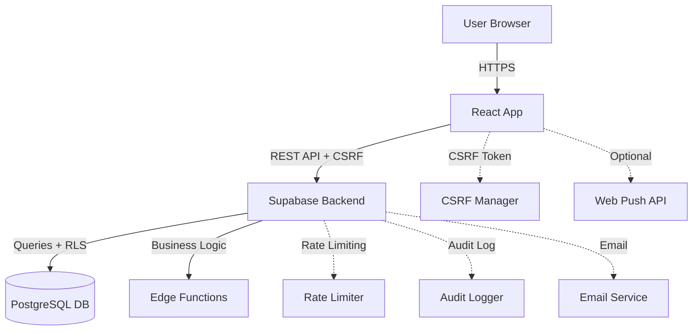

# SYSTEM ARCHITECTURE - Login Hardening

## C4 Level 1: System Context Diagram



## C4 Level 2: Container Diagram

### Frontend Container
- **Technology**: React 18 + Vite
- **State**: Context API + Local Storage
- **Routing**: React Router
- **API Client**: authClient.ts (fetch + CSRF)
- **Caching**: CSRF tokens, rate limit info
- **Security**: CSRF protection, input validation

### Backend Container
- **Database**: PostgreSQL (Supabase hosted)
- **API Layer**: Supabase Auto-generated REST API
- **Business Logic**: Supabase Edge Functions (Deno)
- **Auth**: Supabase Auth + Custom hardening
- **Security**: RLS policies, rate limiting, CSRF
- **Audit**: Comprehensive logging

### Data Flow
```
[User Login Request]
  → [Frontend: CSRF Token Check]
  → [API Call: POST /auth/login]
  → [Edge Function: Rate Limit Check]
  → [Edge Function: CSRF Validation]
  → [Edge Function: Credential Verification]
  → [PostgreSQL: User Lookup + RLS]
  → [PostgreSQL: Rate Limit Update]
  → [PostgreSQL: Audit Log Insert]
  → [Response: Session + Headers]
  → [Frontend: State Update]
  → [UI: Success/Error Display]
```

## Component Diagram (Key Components)

### Frontend Components
- **LoginForm**: UI form con rate limiting feedback
- **RecoveryRequestForm**: Password reset UI
- **AuthClient**: API client con CSRF management
- **CSRFManager**: Token lifecycle management
- **RateLimitManager**: Rate limit state tracking

### Backend Components
- **AuthController**: Edge function entry points
- **RateLimitService**: Bucket management
- **CSRFService**: Token generation/validation
- **AuditService**: Security event logging
- **SessionService**: Session management
- **ValidationService**: Input sanitization

## Security Architecture

### CSRF Protection
- **Token Generation**: UUID v4, 4h expiration
- **Storage**: HttpOnly cookie + X-CSRF-Token header
- **Validation**: Server-side token verification
- **Rotation**: Automatic refresh every 2h

### Rate Limiting
- **Strategy**: Token bucket algorithm
- **Buckets**: IP-based per endpoint
- **Limits**: 
  - Login: 5 attempts/5min
  - Recovery: 3 attempts/15min
- **Escalation**: 10min → 1h → 24h → permanent
- **Storage**: PostgreSQL with automatic cleanup

### Session Management
- **Duration**: 8 hours default
- **Refresh**: Automatic every 4 hours
- **Rotation**: New session on refresh
- **Storage**: Database + HttpOnly cookie
- **Security**: IP binding, user agent validation

## Performance Considerations

### Database Optimization
- **Indexes**: Compound indexes per query pattern
- **RLS**: Efficient tenant isolation
- **Cleanup**: Automated expired data removal
- **Connection Pooling**: Supabase managed

### Caching Strategy
- **Current**: PostgreSQL-based rate limiting
- **Future**: Redis for high-frequency operations
- **Frontend**: CSRF token caching
- **Headers**: Rate limit info caching

### Scalability Targets
- **Concurrent Users**: 100+ simultaneous logins
- **Throughput**: 100 login requests/second
- **Latency**: p95 < 300ms for login
- **Availability**: 99.9% uptime target

## Integration Points

### Existing System
- **Compatible**: Works with current authClient.ts
- **Migration**: Gradual rollout possible
- **Fallback**: Graceful degradation
- **Testing**: Comprehensive test coverage

### Monitoring & Observability
- **Metrics**: Login success rate, latency, errors
- **Logging**: Structured audit trail
- **Alerts**: Rate limit violations, security events
- **Dashboards**: Real-time security metrics

## Deployment Architecture

### Edge Functions
- **Location**: Supabase Edge Runtime
- **Scaling**: Automatic based on demand
- **Cold Start**: < 100ms typical
- **Memory**: 128MB per function

### Database
- **Primary**: Supabase PostgreSQL
- **Backups**: Automated daily backups
- **Replication**: Read replicas for scaling
- **Maintenance**: Automated vacuum/analyze

### Security
- **TLS**: End-to-end encryption
- **Headers**: Security headers (HSTS, CSP)
- **CORS**: Restricted origins
- **Rate Limiting**: Multiple layers
