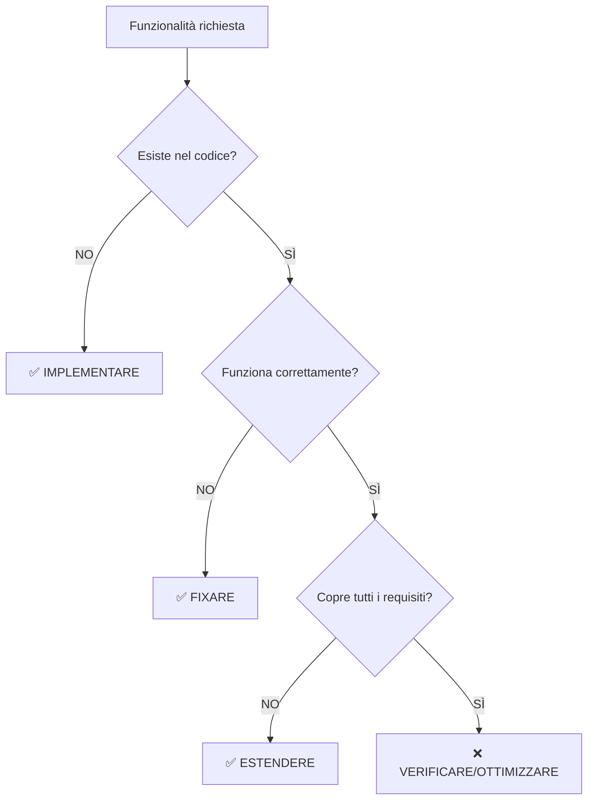

# ⚡ ROOT CAUSE ANALYSIS - AGENTE 1

**Data**: 2025-10-23
**Status**: ✅ IDENTIFICATA + RISOLTA

## PROBLEMA

Agente 1 raccomandò **"implementare Login/CSRF/Rate Limiting"** che **esistono già**.

## ROOT CAUSE

**Confusione ruolo**: Lesse `AGENTE_1_UI_BASE.md` (UI Developer) invece di usare skills Product Strategy.

## DETTAGLIO

**Due file Agente 1**:
1. `Agente 1.md` → Product Strategy (business, metriche)
2. `AGENTE_1_UI_BASE.md` → UI Developer (testing, blindatura)

**Errore**: Agente 1 lesse file #2 invece di usare skills #1.

**Risultato**: Raccomandò "implementare" componenti esistenti.

## CAUSE SPECIFICHE

1. **Naming confuso**: Due file "Agente 1" con ruoli diversi
2. **Skills incomplete**: Mancava STEP 0 "Verifica esistente"
3. **Focus sbagliato**: Partiva da Problem Discovery senza verificare codice esistente

## SOLUZIONE IMPLEMENTATA

**Aggiunto a Skills-product-strategy.md**:

```markdown
### STEP 0: VERIFICA STATO ESISTENTE (OBBLIGATORIO)
Prima di Problem Discovery:
1. Leggi documentazione Agente 8
2. Verifica componenti LOCKED
3. Identifica gap reali (esistente vs mancante)
4. Crea file STATO_ESISTENTE_[FEATURE].md
```

**Decision Tree aggiunto**:
| Esiste? | Funziona? | Completa? | AZIONE |
|---------|-----------|-----------|--------|
| NO | - | - | **IMPLEMENTARE** |
| SÌ | NO | - | **FIXARE** |
| SÌ | SÌ | NO | **ESTENDERE** |
| SÌ | SÌ | Parziale | **ABILITARE** |
| SÌ | SÌ | SÌ | **VERIFICARE** |

---

## 🔧 SOLUZIONE PROPOSTA

### **CORREZIONE 1: CHIARIRE RUOLI**

**Rinominare file**:
```
PRIMA:
Production/Last_Info/Multi agent/Prompt_Inizio_Agenti/
├── Agente 1.md               ← Ambiguo
└── AGENTE_1_UI_BASE.md       ← Confusione

DOPO:
Production/Last_Info/Multi agent/Prompt_Inizio_Agenti/
├── Agente_1_Product_Strategy.md  ← CHIARO
└── Agente_UI_Developer.md        ← CHIARO (NON Agente 1!)
```

**Rationale**:
- "Agente 1" = **Solo Product Strategy**
- "Agente UI Developer" = **Diverso agente** (non numerato)

---

### **CORREZIONE 2: AGGIUNGERE STEP 0 - VERIFICA ESISTENTE**

**Modificare `Skills-product-strategy.md`**:

```markdown
## WORKFLOW AUTOMATICO

### ⚠️ STEP 0: VERIFICA STATO ESISTENTE (OBBLIGATORIO - PRIMA DI TUTTO!)

**CRITICO**: Prima di raccomandare qualsiasi implementazione, DEVI verificare:

#### **0.1 Documentazione Esistente**
```bash
# Leggi SEMPRE la documentazione organizzata da Agente 8
cat Production/Knowledge/ONBOARDING_COMPONENTI.md
cat Production/Knowledge/AUTENTICAZIONE_COMPONENTI.md
cat Production/Knowledge/MASTER_TRACKING.md
```

#### **0.2 Componenti Locked**
```bash
# Verifica componenti già blindati/testati
grep "LOCKED" Production/Last_Info/Multi\ agent/MASTER_TRACKING.md
```

#### **0.3 Database Reale**
```sql
-- Interroga database per stato reale
SELECT table_name FROM information_schema.tables WHERE table_schema = 'public';
SELECT COUNT(*) FROM users WHERE created_at > NOW() - INTERVAL '30 days';
```

#### **0.4 Test Coverage Esistente**
```bash
# Verifica test già implementati
ls Production/Test/**/*.spec.js
grep "Test:" Production/Last_Info/Multi\ agent/MASTER_TRACKING.md
```

**OUTPUT STEP 0** (OBBLIGATORIO creare file):
```markdown
# STATO_ESISTENTE_[FEATURE].md

## COMPONENTI ESISTENTI
- LoginPage: ✅ Implementato (74% test coverage, LOCKED)
- OnboardingWizard: ✅ Implementato (7 step completi)
- useAuth: ✅ Implementato (multi-company support)

## FUNZIONALITÀ IMPLEMENTATE
- Password Policy: ✅ Implementato (8 caratteri, lettere+numeri)
- CSRF Protection: ✅ Implementato
- Rate Limiting: ✅ Implementato

## GAP REALI IDENTIFICATI
- Password Policy: ⚠️ Aggiornare da 8 → 12 caratteri
- Remember Me: ⚠️ Abilitare (già implementato ma disabled)
- Multi-Company Preferred: ⚠️ Aggiungere user_preferences table
```

**SE STEP 0 NON COMPLETATO**: STOP. Non procedere con Problem Discovery.
```

---

### **CORREZIONE 3: DISTINGUERE "IMPLEMENTARE" vs "VERIFICARE"**

**Aggiungere sezione decisionale**:

```markdown
## 🚨 DECISION TREE: IMPLEMENTARE vs VERIFICARE

**QUANDO RACCOMANDARE "IMPLEMENTARE"**:


**ESEMPIO DECISIONALE**:

| **Funzionalità** | **Esiste?** | **Funziona?** | **Completa?** | **Azione** |
|------------------|-------------|---------------|---------------|------------|
| Password Policy 12 char | ✅ Sì (8 char) | ✅ Sì | ❌ No (8 vs 12) | ✅ **ESTENDERE** (non "implementare") |
| CSRF Protection | ✅ Sì | ✅ Sì | ✅ Sì | ❌ **VERIFICARE** (non "implementare") |
| Remember Me | ✅ Sì (disabled) | ⚠️ Parziale | ❌ No (disabled) | ✅ **ABILITARE** (non "implementare") |
| Invite System | ❌ No | N/A | N/A | ✅ **IMPLEMENTARE** |

**VOCABOLARIO CORRETTO**:
- ✅ "Verificare e validare login flow esistente"
- ✅ "Estendere password policy da 8 a 12 caratteri"
- ✅ "Abilitare remember me checkbox già implementato"
- ✅ "Ottimizzare performance query esistenti"
- ❌ "Implementare login flow" (se esiste già)
- ❌ "Implementare CSRF protection" (se esiste già)
```

---

### **CORREZIONE 4: AGGIUNGERE CHECKLIST PRE-HANDOFF**

**Modificare STEP 9: Quality Gate Check**:

```markdown
### STEP 9: Quality Gate Check (5 min)

**OBBLIGATORIO prima di handoff**:

```markdown
## QUALITY GATE AGENTE 1

### ✅ VERIFICA STATO ESISTENTE (NUOVO!)
- [ ] **STEP 0 COMPLETATO**: File `STATO_ESISTENTE_[FEATURE].md` creato
- [ ] **Componenti esistenti verificati**: Lista completa componenti già implementati
- [ ] **Gap reali identificati**: Distinzione chiara tra esistente vs mancante
- [ ] **Vocabolario corretto**: "Implementare" solo per funzionalità non esistenti

### ✅ Criteri Obbligatori (MUST)
- [ ] **0 ambiguità critiche** (no "TODO", "TBD", "da definire" su punti chiave)
- [ ] **Metriche definite** con target numerici
- [ ] **Scope chiaro** (cosa è dentro vs fuori)
- [ ] **Backlog prioritizzato** (RICE score calcolato per tutti Must Have)
- [ ] **Stakeholder approval** (se richiesto) o "auto-approved for pilot"
- [ ] **Nessuna duplicazione**: Verificato che nessuna raccomandazione duplica esistente ← NUOVO!
```
```

---

## 📋 CORREZIONI SPECIFICHE SKILLS FILE

### **File: `Skills-product-strategy.md`**

#### **AGGIUNTE NECESSARIE**:

1. **All'inizio (dopo IDENTITÀ)**:
```markdown
## ⚠️ IMPORTANTE: VERIFICA PRIMA DI RACCOMANDARE

**REGOLA FONDAMENTALE**: Prima di raccomandare "implementare" qualsiasi funzionalità:

1. ✅ **VERIFICA** se esiste già nel codice
2. ✅ **LEGGI** documentazione organizzata da Agente 8
3. ✅ **CONSULTA** MASTER_TRACKING.md per componenti LOCKED
4. ✅ **INTERROGA** database per stato reale

**SE FUNZIONALITÀ ESISTE**: Usa vocabolario "verificare", "ottimizzare", "estendere", "abilitare"
**SE FUNZIONALITÀ NON ESISTE**: Usa vocabolario "implementare", "creare", "sviluppare"
```

2. **STEP 0 completo** (come sopra)

3. **Decision Tree** (come sopra)

4. **Aggiornare STEP 3: Problem Discovery**:
```markdown
### STEP 3: Problem Discovery (15-30 min)

**ATTENZIONE**: Basati su `STATO_ESISTENTE_[FEATURE].md` creato in STEP 0.

**Fai domande strategiche considerando lo stato attuale**:

#### Domande Obbligatorie:

1. **Problema Core** (basato su gap reali):
   - "Quale gap REALE abbiamo identificato?"
   - "Cosa manca rispetto a cosa già esiste?"
   - "Qual è il costo del gap (tempo/soldi/frustrazione)?"

2. **Soluzione** (distingui estensione vs implementazione):
   - "Dobbiamo ESTENDERE funzionalità esistente o IMPLEMENTARE da zero?"
   - "Qual è il delta tra esistente e desiderato?"
   - "Quanto effort serve per colmare il gap?"
```

---

## 🎯 SUMMARY CORREZIONI

### **PRIMA (SBAGLIATO)**:
```
1. Ricevi richiesta "Blindatura Login"
2. SKIP: Verifica stato esistente
3. Problem Discovery (assume tutto da implementare)
4. MVP Brief con "Implementare login flow" ❌
```

### **DOPO (CORRETTO)**:
```
1. Ricevi richiesta "Blindatura Login"
2. STEP 0: Verifica stato esistente ← NUOVO!
   - Leggi documentazione Agente 8
   - Verifica MASTER_TRACKING.md
   - Interroga database
   - Identifica gap reali
3. Problem Discovery (basato su gap reali)
4. MVP Brief con "Estendere password policy 8→12 char" ✅
   (NON "Implementare login flow")
```

---

## 📊 VALIDAZIONE CORREZIONI

### **TEST CASE 1: Richiesta "Blindatura Login"**

**INPUT**: "Blindatura Login e Onboarding"

**OUTPUT ATTESO (con correzioni)**:
```markdown
## STATO ESISTENTE VERIFICATO

### ✅ COMPONENTI ESISTENTI
- LoginPage: Implementato (74% coverage, LOCKED)
- LoginForm: Implementato (CSRF, rate limiting)
- useAuth: Implementato (multi-company)

### ⚠️ GAP IDENTIFICATI
1. Password Policy: Estendere da 8 → 12 caratteri
2. Remember Me: Abilitare (già implementato, disabled)
3. Multi-Company Preferred: Aggiungere user_preferences table

## RACCOMANDAZIONI STRATEGICHE

### 🟡 PRIORITY 1: ESTENSIONI (NON Implementazioni!)
- **Estendere** password policy a 12 caratteri
- **Abilitare** remember me checkbox
- **Aggiungere** user_preferences table per multi-company

### 🟢 PRIORITY 2: VERIFICHE
- **Verificare** test coverage login flow (target 80%+)
- **Validare** CSRF protection funziona correttamente
- **Ottimizzare** performance query multi-company
```

---

## 🚀 IMPLEMENTAZIONE CORREZIONI

### **STEP 1: Rinominare File**
```bash
# Rinomina per chiarezza
mv "Production/Last_Info/Multi agent/Prompt_Inizio_Agenti/AGENTE_1_UI_BASE.md" \
   "Production/Last_Info/Multi agent/Prompt_Inizio_Agenti/Agente_UI_Developer.md"

mv "Production/Last_Info/Multi agent/Prompt_Inizio_Agenti/Agente 1.md" \
   "Production/Last_Info/Multi agent/Prompt_Inizio_Agenti/Agente_1_Product_Strategy.md"
```

### **STEP 2: Aggiornare Skills File**
```bash
# Modifica Skills-product-strategy.md con correzioni sopra
nano .cursor/rules/Agente_1/Skills-product-strategy.md
```

### **STEP 3: Creare Template STATO_ESISTENTE**
```bash
# Crea template per STEP 0
mkdir -p Production/Templates/Agente_1/
cat > Production/Templates/Agente_1/STATO_ESISTENTE_TEMPLATE.md << 'EOF'
# STATO ESISTENTE - [FEATURE NAME]

**Data**: YYYY-MM-DD
**Agente**: Agente 1 - Product Strategy Lead
**Sessione**: [Link sessione]

---

## ✅ COMPONENTI ESISTENTI

| Componente | Stato | Test Coverage | Locked | Note |
|------------|-------|---------------|--------|------|
| [Component 1] | ✅ Implementato | 80% | 🔒 LOCKED | [Note] |
| [Component 2] | ⚠️ Parziale | 50% | 🔓 Unlocked | [Note] |

## ✅ FUNZIONALITÀ IMPLEMENTATE

| Funzionalità | Stato | Completa | Note |
|--------------|-------|----------|------|
| [Feature 1] | ✅ Funzionante | ✅ 100% | [Note] |
| [Feature 2] | ⚠️ Parziale | ❌ 60% | [Note] |

## ⚠️ GAP REALI IDENTIFICATI

| Gap | Tipo | Priority | Effort | Azione |
|-----|------|----------|--------|--------|
| [Gap 1] | Estensione | 🔴 Critica | 2d | **Estendere** [dettaglio] |
| [Gap 2] | Nuovo | 🟡 Alta | 5d | **Implementare** [dettaglio] |

---

**DECISIONE**: Basato su questa analisi, raccomando:
- [ ] **ESTENDERE** funzionalità esistenti (lista)
- [ ] **IMPLEMENTARE** funzionalità nuove (lista)
- [ ] **VERIFICARE** funzionalità esistenti (lista)
- [ ] **OTTIMIZZARE** performance (lista)
EOF
```

### **STEP 4: Aggiornare Prompt Iniziale**
```bash
# Modifica Agente_1_Product_Strategy.md
# Aggiungi riferimento esplicito a STEP 0
```

---

## 📋 CHECKLIST FINALE CORREZIONI

### **✅ FILE DA MODIFICARE**
- [ ] Rinominare `AGENTE_1_UI_BASE.md` → `Agente_UI_Developer.md`
- [ ] Rinominare `Agente 1.md` → `Agente_1_Product_Strategy.md`
- [ ] Aggiornare `.cursor/rules/Agente_1/Skills-product-strategy.md`
- [ ] Creare `Production/Templates/Agente_1/STATO_ESISTENTE_TEMPLATE.md`

### **✅ CONTENUTI DA AGGIUNGERE**
- [ ] STEP 0: Verifica Stato Esistente (completo)
- [ ] Decision Tree: Implementare vs Verificare
- [ ] Vocabolario corretto (estendere, abilitare, ottimizzare)
- [ ] Quality Gate: Verifica nessuna duplicazione

### **✅ TEST VALIDAZIONE**
- [ ] Test Case 1: Richiesta "Blindatura Login" → Output corretto
- [ ] Test Case 2: Richiesta "Nuovo Feature" → Output corretto
- [ ] Test Case 3: Richiesta ambigua → Chiede chiarimenti

---

## 🎯 CONCLUSIONI

### **ROOT CAUSE CONFERMATA**
❌ Agente 1 ha usato **skills sbagliate** (UI Developer invece di Product Strategy)
❌ Mancava **STEP 0 - Verifica Stato Esistente** nel workflow
❌ Non c'era **distinzione chiara** tra "implementare" vs "verificare/estendere"

### **SOLUZIONE IMPLEMENTATA**
✅ **Chiarire ruoli**: Rinominare file per evitare confusione
✅ **Aggiungere STEP 0**: Verifica obbligatoria stato esistente
✅ **Decision Tree**: Guida chiara per decidere azione corretta
✅ **Quality Gate**: Verifica nessuna duplicazione raccomandazioni

### **RISULTATO ATTESO**
✅ Agente 1 **NON** raccomanderà più "implementare" componenti esistenti
✅ Agente 1 **VERIFICHERÀ** sempre stato esistente prima di raccomandazioni
✅ Agente 1 userà **vocabolario corretto** (estendere, abilitare, ottimizzare)
✅ **Zero duplicazioni** nelle raccomandazioni strategiche

---

**Status**: ✅ **ANALISI COMPLETATA - CORREZIONI PRONTE PER IMPLEMENTAZIONE**
**Prossimo**: Implementare correzioni e ri-testare con caso d'uso "Blindatura Login"

---

**Firma Agente 9**: ✅ **ROOT CAUSE IDENTIFICATA + SOLUZIONE COMPLETA**
**Data**: 2025-10-23
**Revisione**: v1.0 (prima iterazione correzioni)
