# 🗺️ Mappa Funzionale dell'Applicazione

**Obiettivo:** Avere una visione d'insieme di tutte le funzionalità dell'app per poterle testare in modo sistematico. Questo documento ti serve come guida e checklist.

---

## 🧭 Mappa Concettuale delle Funzionalità

_Questa mappa mostra come le macro-aree dell'applicazione sono collegate tra loro. Usala per orientarti._

```mermaid
graph TD
    subgraph "Utente"
        A[👤 Login/Registrazione] --> B[🏠 Dashboard];
    end

    subgraph "Funzionalità Principali"
        B --> C{Sistema HACCP};
        B --> D{Gestione Operativa};
        B --> E{Analisi e Report};
        B --> F{Impostazioni};
    end

    subgraph "Sistema HACCP"
        C --> C1[❄️ Conservazione];
        C --> C2[📦 Inventario];
        C --> C3[🔥 Punti Critici];
    end

    subgraph "Gestione Operativa"
        D --> D1[📅 Attività & Calendario];
        D --> D2[👥 Gestione Staff];
        D --> D3[🏢 Dipartimenti];
    end

    subgraph "Analisi e Report"
        E --> E1[📊 Dashboard Avanzata];
        E --> E2[📄 Reportistica];
        E --> E3[🤖 Automazioni];
    end

    subgraph "Mobile"
        M[📱 Funzionalità Mobile] --> C1;
        M --> C2;
        M --> D1;
    end

    style A fill:#F9E79F,stroke:#333,stroke-width:2px
    style B fill:#D5F5E3,stroke:#333,stroke-width:2px
    style M fill:#D6EAF8,stroke:#333,stroke-width:2px
```

---

## ✅ Checklist di Funzionalità per il Testing

_Usa questa checklist per spuntare le funzionalità mentre le testi. Aggiungi note se qualcosa non va come previsto._

### **1. Autenticazione e Accesso**

_Perché: Garantire che solo gli utenti autorizzati possano accedere e che i ruoli siano rispettati._

- [ ] **Login:** L'utente può accedere con email e password.
- [ ] **Logout:** L'utente può disconnettersi correttamente.
- [ ] **Registrazione:** Un nuovo utente può creare un account.
- [ ] **Protezione Rotte:** Un utente non autenticato viene reindirizzato al login.
- [ ] **Controllo Ruoli:** Le sezioni "Gestione" e "Impostazioni" sono accessibili solo ai ruoli corretti (admin/responsabile).

### **2. Dashboard Principale**

_Perché: Fornire una panoramica immediata dello stato del sistema._

- [ ] **Visualizzazione Statistiche:** I KPI principali (es. temperature, task) sono visibili e si aggiornano.
- [ ] **Azioni Rapide:** I pulsanti per le azioni comuni (es. "Registra Temperatura") funzionano.
- [ ] **Attività Recenti:** La lista delle ultime attività è corretta.

### **3. Sistema di Conservazione (HACCP)**

_Perché: Il cuore del monitoraggio HACCP per la sicurezza alimentare._

- [ ] **Creazione Punti di Conservazione:** Si può aggiungere un nuovo frigo, freezer, ecc.
- [ ] **Registrazione Temperature:** Si può inserire una nuova lettura di temperatura per un punto.
- [ ] **Visualizzazione Storico Temperature:** Si può vedere la cronologia delle letture.
- [ ] **Gestione Manutenzioni:** Si possono creare e completare task di manutenzione.
- [ ] **Filtri:** I filtri per stato, tipo e data funzionano correttamente.

### **4. Sistema di Inventario (HACCP)**

_Perché: Tracciare prodotti e scadenze per evitare sprechi e rischi._

- [ ] **Gestione Categorie:** Si possono creare e modificare le categorie dei prodotti.
- [ ] **Gestione Prodotti:** Si possono aggiungere nuovi prodotti con data di scadenza.
- [ ] **Allergeni:** Si possono associare allergeni ai prodotti.
- [ ] **Shopping List:** Si possono creare e gestire liste della spesa.
- [ ] **Alert Scadenze:** Il sistema notifica i prodotti in scadenza (visivamente o tramite notifiche).

### **5. Attività e Calendario**

_Perché: Organizzare e tracciare tutte le operazioni pianificate._

- [ ] **Visualizzazione Calendario:** Gli eventi (task, manutenzioni, scadenze) sono visibili sul calendario.
- [ ] **Creazione Eventi:** Si può creare un nuovo task o evento.
- [ ] **Dettaglio Evento:** Cliccando su un evento si vedono i dettagli.
- [ ] **Filtri Calendario:** Si può filtrare per tipo di evento.

### **6. Gestione Operativa**

_Perché: Amministrare la struttura organizzativa dell'azienda._

- [ ] **Gestione Dipartimenti:** (Admin) Può creare e modificare dipartimenti.
- [ ] **Gestione Staff:** (Admin) Può aggiungere nuovi membri dello staff e assegnare ruoli.

### **7. Funzionalità Mobile (PWA)**

_Perché: Garantire che l'app funzioni come un'app nativa su dispositivi mobili, anche offline._

- [ ] **Installazione PWA:** Il browser propone di "installare" l'app sulla home screen.
- [ ] **Accesso Fotocamera:** L'app può usare la fotocamera per scansionare barcode o fare foto.
- [ ] **Accesso GPS:** L'app può usare la geolocalizzazione (es. per punti di conservazione multi-sede).
- [ ] **Funzionamento Offline:** Le funzionalità di base (es. registrare una temperatura) funzionano senza connessione.
- [ ] **Sincronizzazione Offline:** I dati inseriti offline vengono sincronizzati quando l'app torna online.
- [ ] **Notifiche Push:** L'app può ricevere notifiche (es. per alert di temperatura).

### **8. Automazioni e Report (Funzionalità Avanzate)**

_Perché: Semplificare i processi e fornire insight basati sui dati._

- [ ] **Reportistica:** Si possono generare report (es. log temperature) in formato PDF/Excel.
- [ ] **Alert Intelligenti:** Il sistema invia notifiche per eventi critici (es. temperatura fuori soglia).
- [ ] **Dashboard Analitica:** La sezione di analytics mostra grafici e trend.

---

_Questa checklist è un punto di partenza. Sentiti libero di espanderla man mano che esplori l'applicazione._
