# 🐛 Guida Visiva alla Segnalazione di Bug (per Agenti AI)

**Obiettivo:** Aiutare il mio utente a tracciare e risolvere i problemi in modo rapido ed efficiente, seguendo il suo metodo di apprendimento pratico e visivo.

---

## 🗺️ Mappa del Processo di Bug Reporting

```mermaid
graph TD
    A[🐞 Trovo un Bug] --> B{Perché è un problema?};
    B --> C[1. 📝 Compilo il Report];
    C --> D{Dove va messo?};
    D --> E[2. 📂 Lo catalogo per priorità];
    E --> F[3. ✍️ Aggiorno l'indice];
    F --> G[✅ Fatto! Ora attendo il fix];
```



---

## 📝 Step 1: Compila il Report del Bug

*   **Perché?** Per dare al team tutte le informazioni necessarie per capire e risolvere il problema senza dover chiedere altro.
*   **Azione:** Crea un nuovo file Markdown usando questo template. Non lasciare sezioni vuote.

### Template del Report (da copiare)

```markdown
# 🐛 Bug Report: [Titolo Breve e Descrittivo]

**Data:** YYYY-MM-DD
**Agente:** [Il tuo nome, es. Gemini]
**Priorità:** [Critica | Alta | Media | Bassa] <!-- Scegli una priorità -->
**Status:** Aperto

---

### 📍 **Il Problema in Breve**

*   **Cosa succede?** [Descrivi il problema in una sola frase. Esempio: "Il pulsante Salva nel form dei prodotti non risponde al click."]
*   **Perché è un problema?** [Spiega l'impatto pratico. Esempio: "Gli utenti non possono aggiungere nuovi prodotti all'inventario."]

### 🚶 **Come Replicare il Problema (Passo dopo Passo)**

*Visualizza il percorso dell'utente:*

```mermaid
graph LR
    subgraph Percorso Utente
        A[Login] --> B[Va a /inventario];
        B --> C[Clicca "Aggiungi Prodotto"];
        C --> D[Compila il form];
        D --> E[Clicca "Salva"];
    end
    subgraph Problema
        E -- Errore --> F[❌ Il pulsante non fa nulla];
    end
```

1.  **Partenza:** [Da dove inizia l'utente? Es: Dalla Dashboard]
2.  **Azione 1:** [Cosa fa? Es: Clicca su "Inventario" nel menu]
3.  **Azione 2:** [E poi? Es: Clicca sul pulsante "Aggiungi Prodotto"]
4.  **...**
5.  **Punto di rottura:** [L'azione che causa il bug. Es: Clicca su "Salva"]

### 🎯 **Cosa mi Aspettavo (Comportamento Corretto)**

[Descrivi il risultato ideale. Esempio: "Mi aspettavo che il prodotto venisse salvato e di vedere un messaggio di successo."]

### 💥 **Cosa è Successo (Comportamento Errato)**

[Descrivi il risultato attuale. Esempio: "Il pulsante è rimasto inattivo, nessun messaggio, e il prodotto non è stato aggiunto."]

---

### 🔬 **Dettagli Tecnici (per il Debug)**

*   **Ambiente:**
    *   **Browser:** [Es: Chrome 128]
    *   **Dispositivo:** [Es: Desktop]
*   **Log Console:**
    ```
    [Incolla qui eventuali errori dalla console del browser]
    ```
*   **Screenshot:**
    `[Allega uno screenshot, se utile]`

---

### ✅ **Checklist per l'Agente (Post-Fix)**

*Quando il bug sarà risolto, verifica questi punti:*

- [ ] Il percorso utente descritto sopra ora funziona come previsto.
- [ ] Le funzionalità correlate non sono state compromesse.
- [ ] Il fix funziona anche su mobile.
- [ ] Non sono stati introdotti nuovi errori in console.
```

---

## 📂 Step 2: Cataloga il Report

*   **Perché?** Per organizzare il lavoro e dare priorità alle cose più importanti.
*   **Azione:** Salva il file che hai creato nella cartella corretta in base alla priorità.

### Mappa delle Cartelle

```mermaid
graph TD
    subgraph "Project_Knowledge/Bug_Reports"
        A["bug-report.md"] --> B{Priorità?};
        B -- Critica --> C[🔴 Critical/];
        B -- Alta --> D[🟠 High/];
        B -- Media --> E[🟡 Medium/];
        B -- Bassa --> F[🟢 Low/];
    end
```



*   **Nome File:** Usa il formato `YYYY-MM-DD_descrizione-del-bug.md`.

---

## ✍️ Step 3: Aggiorna l'Indice

*   **Perché?** Per avere una visione d'insieme di tutti i problemi aperti e chiuderli quando risolti.
*   **Azione:** Apri il file `Project_Knowledge/Bug_Reports/bug-tracking-index.md` e aggiungi una nuova riga per questo bug.

---

Grazie per la collaborazione! Questo processo ci aiuterà a lavorare meglio insieme.
